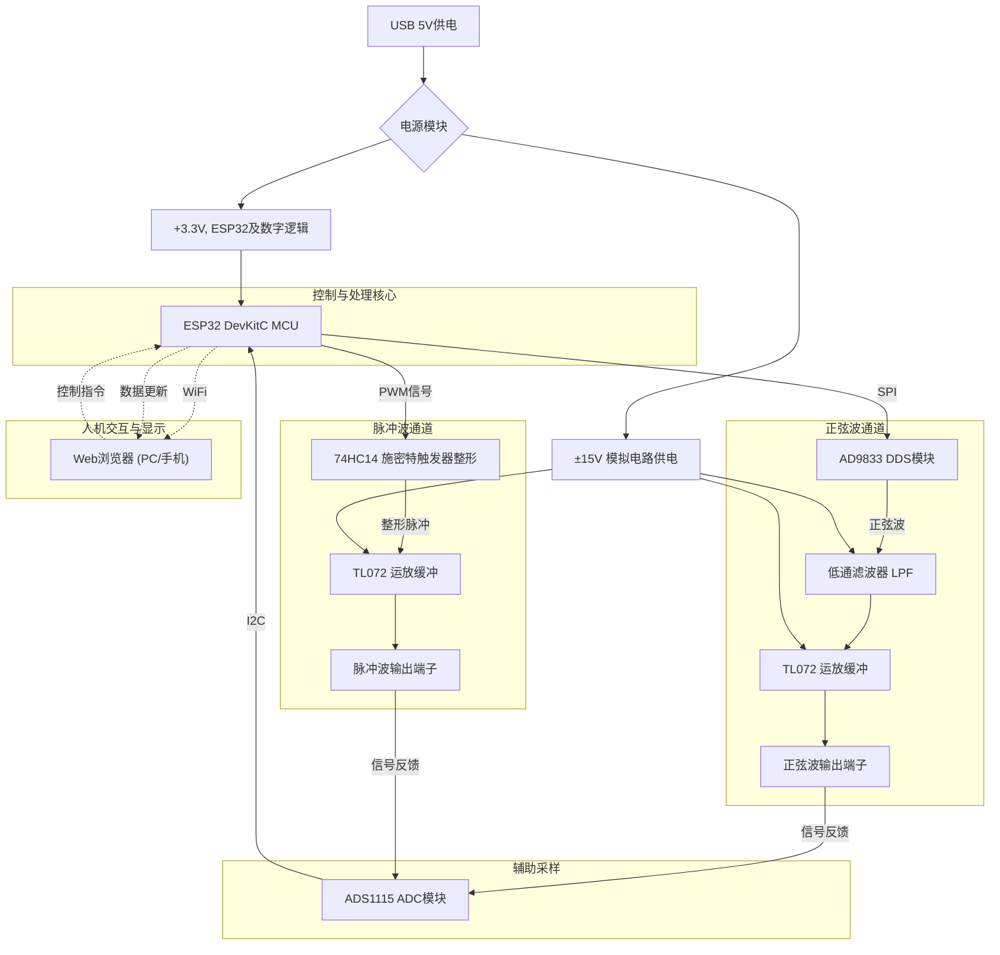
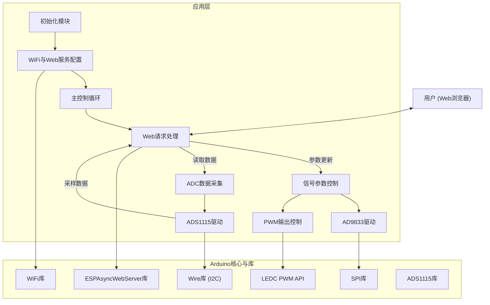

# 2025年全国大学生电子设计竞赛

## B题：实用信号源的设计与制作（2025版）

**参赛队伍：** \[请在此处填写队伍名称\]
**参赛队员：** \[请在此处填写队员姓名\]
**指导教师：** \[请在此处填写指导教师姓名\]
**提交日期：** 2025年5月10日

## 摘要

本项目旨在设计并制作一款现代化的实用信号源，能够产生精确可调的正弦波和脉冲波。系统以ESP32微控制器为核心，结合高精度直接数字频率合成器（DDS）AD9833模块和ESP32内置PWM模块，实现了20Hz至20kHz频率范围内的信号输出。正弦波失真度低，脉冲波占空比可灵活调节，输出幅度满足设计要求并能驱动标准负载。本项目的主要创新点在于引入了基于Web前端的远程控制与参数显示界面，用户可以通过网页实时监控和调整信号源的各项参数。设计中充分考虑了信号质量、系统稳定性和用户交互体验，并对关键电路进行了仿真分析和优化。本文详细阐述了项目的总体方案、硬件系统设计、软件架构、调试过程以及测试结果，并包含了相关的计算、仿真、版图和代码资料。

## 一、任务与要求回顾

### 1.1 项目任务

在给定电源条件下（本项目采用USB供电，内部通过DC-DC模块升压至±15V为模拟电路供电），设计并制作一个能够输出正弦波和脉冲波的实用信号源。

### 1.2 基本要求（参照1995年题目并结合现代需求）

**(1) 正弦波信号源:**

* **信号频率：** 20 Hz \~ 20 kHz，步进可调（本项目方案支持更精细步进，如1Hz）。

* **频率稳定度：** 优于 $10^{-4}$ (由AD9833及外部晶振保证)。

* **非线性失真系数：** $\le 3%$ (目标通过滤波优化达到更优指标)。

**(2) 脉冲波信号源:**

* **信号频率：** 20 Hz \~ 20 kHz，步进可调（本项目方案支持更精细步进，如1Hz）。

* **上升和下降时间：** $\le 1 \mu s$ (通过74HC14整形实现)。

* **平顶斜降：** $\le 5%$。

* **脉冲占空比：** 2% \~ 98% 步进可调，步长可灵活设置（本项目方案支持更精细步进，如1%）。

**(3) 公共要求:**

* **频率可预置与实时调整：** 通过Web前端或预留接口。

* **输出幅度：** 在负载为600Ω时，输出幅度约为3V峰值 (Vpp)。

* **频率数字显示：** 5位以上频率数字显示（通过Web前端实现）。

### 1.3 发挥部分/创新要求（结合2025年项目特色）

* **频率步进：** 正弦波和脉冲波频率步长可实现1Hz或更优。

* **幅度调整：** （可根据实际设计添加）若设计了可程控幅度调整，详细说明范围和步长。

* **Web前端控制与显示：** 实现通过网页远程设置频率、占空比，并实时显示当前参数和波形趋势。为实现Web界面与ESP32硬件的实时双向通信，采用了\[此处填写具体技术，如WebSocket或优化的HTTP长轮询策略\]。开发过程中，针对数据同步和界面动态刷新延迟等问题，采取了\[此处填写解决方案，如优化数据包大小、前端异步更新、特定事件触发刷新等策略\]加以解决。

* **辅助波形验证：** 通过ADS1115 ADC模块采样输出信号，并在Web前端展示电压趋势图。

* **系统集成度与便携性：** 采用模块化设计，洞洞板焊接，USB供电，提高系统实用性。

## 二、总体方案论证与选择

### 2.1 方案比较

在项目初期，我们针对信号源的核心功能模块进行了多种方案的比较和论证：

**(1) 正弦波产生方案：**

* **方案一：基于运算放大器的RC/LC振荡电路（如文氏桥、相移振荡器）：**

  * 优点：电路结构相对简单，成本较低。

  * 缺点：频率调节不便，频率稳定度和准确度不高，难以实现宽范围、高精度的数字程控频率调整，波形失真度控制较难。

* **方案二：专用函数发生器芯片（如XR2206、ICL8038 - 已逐渐淘汰）：**

  * 优点：能同时产生多种波形，外围电路相对简单。

  * 缺点：频率稳定度和精度一般，失真度较大，数字程控复杂，部分型号已停产或不易获取。

* **方案三：直接数字频率合成（DDS - Direct Digital Synthesis）：**

  * 优点：频率分辨率高（例如，AD9833在使用25MHz主时钟时，频率分辨率可达约0.093Hz）、转换速度快、相位连续、频率和相位易于数字程控，输出波形稳定、失真度低（典型的无杂散动态范围SFDR较高）。

  * 缺点：可能需要较好的主控MCU进行控制（如SPI接口配置），输出存在阶梯波，需要后续精心设计的低通滤波器以消除谐波和镜像频率。其相位噪声性能通常优于简单MCU+DAC方案。

* **方案四：MCU + R2R DAC网络软件合成：**

  * 优点：成本极低，软件定义灵活性高。

  * 缺点：对MCU实时性能要求极高，尤其在高频输出时，MCU的计算能力和精确的定时中断成为瓶颈，难以保证波形质量（如每个周期的采样点数会显著下降）。DAC的精度直接受限于电阻网络的匹配精度和位数（例如，一个8位R2R DAC的理论动态范围仅为约48dB），导致波形失真度较大，频率稳定性和精度也较差。

**(2) 脉冲波产生及占空比控制方案：**

* **方案一：555定时器电路：**

  * 优点：经典方案，电路简单。

  * 缺点：频率和占空比调节相互影响，高精度、宽范围程控困难，高频性能一般。

* **方案二：MCU内置PWM模块：**

  * 优点：频率和占空比数字程控方便、精度高，现代MCU（如ESP32）PWM性能强大。

  * 缺点：直接输出的PWM波形上升下降沿可能不够陡峭，需要整形。

* **方案三：基于比较器的整形电路：**

  * 优点：可以将其他波形（如三角波、正弦波）转换为脉冲波，占空比可通过比较电平调节。

  * 缺点：若基于模拟方式调节占空比，程控精度和线性度是挑战。

**(3) 控制核心及显示方案：**

* **方案一：传统单片机（如STM32、AVR系列）+ 物理按键 + LCD/数码管显示：**

  * 优点：方案成熟，实时性好。

  * 缺点：人机交互界面相对固定，远程控制和复杂数据显示能力有限，按键和显示屏占用较多I/O。

* **方案二：带网络功能的MCU（如ESP32）+ Web服务前端：**

  * 优点：交互界面灵活（HTML+JS），可实现远程控制和丰富的数据可视化，MCU本身性能强劲。

  * 缺点：需要处理网络通信和Web服务，对软件开发有一定要求。

### 2.2 实施方案确定

综合考虑项目的各项要求、技术发展趋势以及团队的技术储备，我们最终确定了以下实施方案：

* **控制核心：** 选用 **ESP32 DevKitC** 开发板。ESP32具备强大的双核处理器、丰富的片上外设（SPI, I2C, PWM, ADC等）以及Wi-Fi和蓝牙功能，能够满足信号产生控制、数据处理以及Web服务等多重任务需求。

* **正弦波产生：** 采用 **AD9833** DDS模块。AD9833是一款低功耗、可通过SPI接口编程的DDS芯片，能够产生高质量的正弦波、三角波和方波。其频率和相位均可精密控制，满足设计要求。

* **脉冲波产生：** 利用 **ESP32内置的PWM模块**。ESP32的LEDC（LED Control）外设可提供高分辨率、高频率的PWM输出，频率和占空比均可由软件精确设定。

* **脉冲波边沿整形：** PWM输出后，经过一片 **74HC14施密特反相器** 进行整形，以获得陡峭的上升沿和下降沿，满足$\\le 1 \\mu s$的要求。

* **信号缓冲与驱动：** 正弦波和脉冲波输出均经过 **TL072** 等运放构成的电压跟随器进行缓冲，以提高带载能力，确保在600Ω负载下幅度稳定。

* **幅度控制：** （根据您的实际设计填写，若为固定幅度，则说明。若有可调，则说明实现方式，例如数字电位器、可编程增益放大器或DAC控制运放增益等）。本项目初步设计为固定输出幅度约3Vpp，通过电阻分压或运放增益设定。

* **频率与参数显示/控制：** 利用ESP32搭建Web服务器，通过 **HTML+JavaScript构建网页前端**。用户可以通过浏览器访问该网页，实时查看当前输出频率、波形类型、占空比等参数，并进行在线调整。

* **辅助波形采样显示：** 使用 **ADS1115** 16位I2C ADC模块对输出信号进行采样，将采样数据通过ESP32传回Web前端，以趋势图的形式大致展示输出波形的幅值变化，辅助验证。

* **电源系统：** 采用5V USB接口（如充电宝或USB适配器）供电，通过板载DC-DC升压模块产生 **±15V** 对称电源，为运放等模拟电路供电。数字电路部分由ESP32开发板自身稳压电路提供3.3V。

**系统总体框图如下所示：**



*\[图2-1 系统总体框图\]*

## 三、硬件系统设计与实现

### 3.1 ESP32最小系统及外围接口

* **ESP32 DevKitC核心板：** 集成了ESP32-WROOM-32模组、USB转串口电路、复位和启动模式按键、3.3V稳压器等，构成完整的最小系统。

* **SPI接口：** 用于与AD9833 DDS模块通信，配置其工作模式、输出频率和相位。

  * `MOSI` (Master Out Slave In)

  * `MISO` (Master In Slave Out) - AD9833通常为只写，此引脚可能不接

  * `SCLK` (Serial Clock)

  * `FSYNC` (Frame Synchronize / Chip Select for AD9833)

* **I2C接口：** 用于与ADS1115 ADC模块通信，读取采样数据。

  * `SDA` (Serial Data)

  * `SCL` (Serial Clock)

* **PWM输出引脚：** 用于输出脉冲波信号。选择ESP32具有LEDC功能的GPIO。

* **GPIO控制引脚：** 可能用于选择输出波形类型（如果通过硬件开关切换）或控制其他辅助功能。

### 3.2 正弦波产生电路

**(1) AD9833 DDS模块：**

* 核心器件：Analog Devices AD9833。

* 外部晶振：模块自带25MHz有源晶振，作为AD9833的主时钟 $MCLK$。

* 频率控制字：通过SPI写入32位频率控制字（两个16位寄存器 $FREQ0, FREQ1$）来设定输出频率。输出频率 $f_{out} = (Frequency\ Register\ Value \times MCLK) / 2^{28}$。

* 相位控制：可编程相位寄存器，用于相位调制（本项目中主要用于设定初始相位或不使用）。

* 波形选择：可输出正弦波、三角波、方波（本项目中主要使用其正弦波输出）。

* 输出：电流型输出，通常模块上会集成I-V转换运放和初步滤波。

**(2) 低通滤波器（LPF）：**

* **设计目标与类型选择：**

  * 目的：有效滤除AD9833 DDS输出的阶梯波所引入的高次谐波（主要在采样时钟频率的整数倍附近）和镜像频率，从而得到平滑、低失真的正弦波输出。

  * 选型：本项目选用 **二阶Sallen-Key有源低通滤波器**。选择该拓扑的原因在于其结构相对简单、易于实现单位增益（或可调增益）、能够提供较好的巴特沃斯（最大平坦通带）或切比雪夫（更快滚降速率）响应特性，并且使用运放可以提供缓冲作用，避免负载影响滤波器性能。为平衡通带平坦度和滚降速率，我们选择设计为巴特沃斯响应。

* **截止频率** $f_c$ **与参数计算：**

  * 截止频率设定：考虑到信号输出最高频率为20kHz，为保证20kHz信号的完整性并有效衰减其谐波及DDS时钟（25MHz）产生的杂散，我们将滤波器的截止频率 $f_c$ 设定在 **40kHz**。

  * 计算公式（单位增益Sallen-Key，巴特沃斯响应 $Q=1/\sqrt{2} \approx 0.707$）：
    对于 $R_1 = R_2 = R$ 和 $C_1 = C_2 = C$ 的简化情况（或通过选择合适的R、C比例实现特定Q值）：
    $f_c = 1 / (2\pi RC)$
    为达到 $Q=0.707$，通常选择 $R_1, R_2, C_1, C_2$ 的特定比例，或者如果 $R_1=R_2=R$ 且 $C_1=C_2=C$，则 $Q=0.5$（欠阻尼）。为实现巴特沃斯响应，通常取 $R_1=R_2=R$，$C_2$ 约为 $2C_1$ (或反之)，并调整R值。更精确的设计是：
    $f_c = 1 / (2\pi \sqrt{R_1 R_2 C_1 C_2})$
    $Q = \sqrt{R_1 R_2 C_1 C_2} / (C_2(R_1+R_2))$ (对于Sallen-Key单位增益低通)
    为简化设计并获得近似巴特沃斯响应，我们设定 $R_1 = R_2 = R$。则 $Q = \sqrt{C_1/C_2}/2$。若取 $C_1 = 2C_2$，则 $Q = \sqrt{2}/2 = 0.707$。
    此时 $f_c = 1 / (2\pi R \sqrt{C_1 C_2}) = 1 / (2\pi R \sqrt{2C_2^2}) = 1 / (2\pi R C_2 \sqrt{2})$。

  * 元件选值：
    假设选取 $C_2 = 1 \text{ nF}$，则 $C_1 = 2 \text{ nF}$。
    $R = 1 / (2\pi f_c C_2 \sqrt{2}) = 1 / (2\pi \times 40 \times 10^3 \text{ Hz} \times 1 \times 10^{-9} \text{ F} \times \sqrt{2}) \approx 1 / (0.000355) \approx 2817 \Omega$。
    选用标称值：$R_1 = R_2 = 2.7 \text{ k}\Omega$ (或 $3 \text{ k}\Omega$)， $C_2 = 1 \text{ nF}$，$C_1 = 2.2 \text{ nF}$ (或使用两个 $1 \text{ nF}$ 并联)。实际选型会根据可获得的元件进行微调，并通过仿真验证。

* **仿真验证：**

  * \[此处应插入在LTspice/Multisim等仿真软件中搭建的二阶Sallen-Key低通滤波器电路图截图，明确标注元件参数。\]

  * **幅频特性仿真结果：**
    \[此处应插入滤波器的幅频响应曲线图。图中标注-3dB截止频率点，观察通带是否平坦，阻带衰减斜率是否接近-40dB/十倍频。\]
    分析：仿真结果显示，滤波器的-3dB截止频率约为 \[XX.X kHz\]，与设计目标 \[40kHz\] \[基本吻合/存在X%偏差\]。通带在20kHz内较为平坦，波动小于 \[X dB\]。在 \[更高频率，如100kHz或DDS时钟频率附近\] 处的衰减达到 \[YY dB\]，能够有效抑制高次谐波。

  * **相频特性仿真结果：**
    \[此处应插入滤波器的相频响应曲线图。\]
    分析：相频特性显示在通带内相位变化较为线性/存在一定非线性，在截止频率附近相位急剧变化。这对于信号源应用影响较小，主要关注幅度特性。

* **实际搭建与调试：**
  根据仿真结果和实际元件值，在洞洞板上搭建滤波器电路，并使用信号发生器和示波器进行实际测试验证。

**(3) 缓冲与幅度调整：**

* 缓冲：TL072运放构成的电压跟随器，提供高输入阻抗和低输出阻抗，增强驱动能力。

* 幅度设定：通过AD9833输出后的电阻分压网络或运放的增益来设定输出幅度，目标为3Vpp。

### 3.3 脉冲波产生与整形电路

**(1) ESP32 PWM模块（LEDC）：**

* 配置：设置PWM频率（对应脉冲波频率20Hz-20kHz）和占空比（2%-98%）。ESP32的LEDC支持高精度频率和占空比设置。

  * 例如，使用13位分辨率的LEDC定时器，在80MHz时钟下，可以获得很高的PWM精度。

* 输出：ESP32 GPIO直接输出3.3V逻辑电平的PWM波。

**(2) 施密特触发器整形（74HC14）：**

* 目的：将ESP32 PWM输出的可能带有一定缓变时间的边沿，整形为快速跳变的陡峭边沿，满足上升/下降时间 $\le 1 \mu s$ 的要求。

* 原理：74HC14内含六路带施密特触发特性的反相器，利用其回差特性可以有效改善输入信号的边沿质量，并抑制噪声。通常使用一级或两级反相（如果需要同相输出）。

* \[此处可插入示波器截图对比整形前后的脉冲边沿\]

**(3) 缓冲与幅度调整：**

* 缓冲：同样使用TL072运放构成的电压跟随器。

* 幅度设定：由于74HC14输出为标准的CMOS电平（接近0V和3.3V或5V，取决于74HC14的供电），若需要3Vpp输出，可能需要经过分压或合适的电平转换及放大电路。如果74HC14使用+5V供电，其输出高电平接近5V，低电平接近0V。若直接驱动负载，需考虑电平匹配和幅度。

  * 如果最终输出要求以0V为中心对称（例如 ±1.5V），则需要更复杂的电平平移和放大电路。题目要求幅度为3V，未指明是峰峰值还是单边幅度，通常理解为峰峰值。若输出为0-3V的脉冲，则相对简单。

### 3.4 幅度控制与驱动电路（统一部分）

* 输出选择：可以使用模拟开关（如CD4051/4052）在单片机控制下选择输出正弦波或脉冲波。或者设计两个独立的输出端口。

* 输出驱动：末级运放（如TL072的另一半或专用线路驱动器）配置为电压跟随器或具有一定增益的同相放大器，确保在600Ω负载下能稳定输出所需幅度，并防止负载对前级电路产生影响。

* 输出保护：可以考虑增加限流电阻或TVS管等简单的输出保护措施。

### 3.5 辅助ADC采样电路 (ADS1115)

* 连接：通过I2C总线与ESP32连接。

* 配置：设置为单通道差分或单端输入模式，配置合适的采样率和增益（PGA）。

* 输入：通过电阻分压网络将输出信号（0-3V或±1.5V）衰减至ADS1115的输入电压范围（例如0-VDD或±PGA设定值）。

* \[此处应有ADS1115前端信号调理电路图及参数计算\]

### 3.6 电源模块

* 输入：标准USB Type-A或Type-C接口，接受5V直流输入。

* DC-DC转换：

  * **±15V输出：** 选用成熟的DC-DC升压模块，将5V转换为对称的±15V，为TL072等运放供电。注意模块的输出电流能力和纹波特性。

  * **+3.3V输出：** ESP32 DevKitC开发板自带AMS1117-3.3等LDO，将5V转换为3.3V供ESP32及其他数字逻辑芯片（如74HC14若使用3.3V供电）使用。

* 滤波：在各电源输入输出端增加滤波电容（如10uF电解电容和0.1uF瓷片电容组合），减少噪声和纹波。

* 接地：统一模拟地和数字地（在PCB设计时考虑单点接地或磁珠隔离）。本项目在洞洞板上应确保所有GND连接到共同的接地点。

## 四、软件系统设计

软件系统基于ESP32的Arduino框架进行开发，主要包括设备驱动、信号生成控制、Web服务、数据处理和用户交互等模块。

### 4.1 软件总体架构



*\[图4-1 软件系统架构图\]*

### 4.2 各模块功能详解

**(1) 初始化模块 (`setup()`函数):**

* 初始化串口通信，用于调试信息输出。

* 初始化GPIO引脚模式（SPI, I2C, PWM, 控制引脚等）。

* 初始化SPI总线，为AD9833通信做准备。

* 初始化I2C总线，为ADS1115通信做准备。

* 初始化AD9833芯片，设置默认输出频率、波形（如20Hz正弦波）。

* 初始化ESP32的LEDC PWM通道，设置默认频率和占空比。

* 初始化ADS1115芯片，设置采样率和增益。

* 配置WiFi模式（AP模式或STA模式），启动Web服务器。

* 设置Web服务器的请求处理回调函数。

**(2) WiFi与Web服务配置模块:**

* **WiFi模式选择：**

  * AP模式：ESP32作为无线接入点，用户设备直接连接ESP32创建的WiFi网络。

  * STA模式：ESP32连接到现有的局域网中，用户设备在同一局域网内访问。

* **Web服务器：** 使用`ESPAsyncWebServer`（推荐，异步处理性能更好）或`ESP8266WebServer`（兼容ESP32）库。

  * 定义根路径 ("/") 的处理函数，返回主控制HTML页面。

  * 定义参数设置路径 (如 "/setParams") 的处理函数，接收来自前端的频率、占空比、波形类型等参数，并调用信号控制模块更新输出。

  * 定义数据获取路径 (如 "/getData") 的处理函数，用于前端轮询获取当前信号参数和ADC采样数据。

  * 处理静态资源（CSS, JavaScript文件，如果分离存放的话）。

**(3) AD9833驱动模块:**

* 封装函数，通过SPI总线向AD9833写入控制字。

  * `void AD9833_WriteRegister(uint16_t data)`: 发送16位数据。

  * `void AD9833_SetFrequency(uint32_t freq_hz)`: 根据输入的Hz值，计算频率控制字并写入FREQ0/FREQ1寄存器。

  * `void AD9833_SetPhase(uint16_t phase_val)`: 设置相位（如果需要）。

  * `void AD9833_SelectWaveform(uint8_t wave_type)`: 选择输出波形（正弦/三角/方波）。

  * `void AD9833_Reset()`: 复位AD9833。

  * `void AD9833_Init()`: 初始化序列。

**(4) PWM输出控制模块:**

* 使用ESP32的LEDC API。

  * `ledcSetup(channel, freq, resolution_bits)`: 配置PWM通道、频率和分辨率。

  * `ledcAttachPin(gpio_pin, channel)`: 将PWM通道附加到GPIO引脚。

  * `ledcWrite(channel, duty_cycle_val)`: 设置占空比。`duty_cycle_val`的范围取决于`resolution_bits`。

* 封装函数，根据Web前端传入的频率和占空比（百分比）参数，转换为LEDC API所需的参数并更新输出。

**(5) ADS1115驱动与数据采集模块:**

* 使用现成的ADS1115库（如Adafruit ADS1X15库）。

* `ads.begin()`: 初始化ADS1115。

* `ads.setGain(GAIN_TWOTHIRDS)`: 设置增益（根据输入信号范围调整）。

* `ads.readADC_SingleEnded(channel)` 或 `ads.readADC_Differential_0_1()`: 读取ADC转换结果。

* 数据处理：将ADC原始读数转换为实际电压值，并可能进行简单滤波或数据压缩，准备发送给前端。

**(6) Web请求处理与主控制循环 (`loop()`函数):**

* 在`loop()`中，Web服务器库会自动处理客户端连接和请求（对于异步库，回调函数会被触发）。

* 定期（如果需要主动推送数据）或在特定请求下，读取ADS1115的采样数据。

* 处理前端发送过来的控制指令，更新全局变量（如当前频率、占空比等），并调用相应的驱动模块更新硬件状态。

* \[可选\] 实现非阻塞延时，用于定时任务，如固定频率采样ADC。

### 4.3 Web前端设计 (HTML, CSS, JavaScript)

* **HTML (结构):**

  * 页面标题、基本布局（如划分为参数显示区、控制区、波形图显示区）。

  * 输入框或滑块用于设置频率、占空比。

  * 按钮用于切换波形类型（正弦/脉冲）、启动/停止信号、提交参数。

  * 文本区域用于显示当前频率、占空比、输出幅度等状态信息。

  * Canvas元素用于绘制ADC采样数据的趋势图。

* **CSS (样式):**

  * 美化页面元素，使其布局合理、易于查看和操作。

  * 响应式设计，适应不同屏幕尺寸（PC、平板、手机）。

* **JavaScript (交互与通信):**

  * **参数设置：** 获取用户在输入框或滑块中设定的值，通过HTTP GET或POST请求（如使用`fetch` API或`XMLHttpRequest`）发送到ESP32的Web服务器的对应路径 (如 "/setParams")。

  * **数据获取与刷新：** 定期（如每秒1-2次）向ESP32的 "/getData" 路径发送请求，获取最新的信号参数和ADC采样数据。

  * **数据显示：** 将获取到的数据显示在HTML页面的相应位置。

  * **图表绘制：** 使用JavaScript图表库（如Chart.js, Plotly.js的轻量级替代，或手动画Canvas）将ADC采样数据显示为实时波形趋势图。

  * **用户输入验证：** 对用户输入的频率、占空比等进行合法性检查。

## 五、方案讨论、数据计算、电路仿真与版图设计

### 5.1 方案讨论的进一步深化

* **精度与稳定性：**

  * AD9833的频率精度主要取决于其25MHz参考晶振的精度和稳定性。选择高精度晶振或考虑温补晶振（TCXO）可以进一步提升。

  * ESP32 PWM的频率和占空比精度受其主频和LEDC定时器分辨率影响，对于本项目要求通常足够。

* **失真度控制：**

  * 正弦波失真主要来自DDS的量化噪声和非线性，以及后续滤波器的特性。LPF的设计至关重要，需要平衡通带平坦度、阻带衰减和相位响应。

  * 脉冲波的平顶斜降主要与驱动能力和负载特性有关，运放的选择和输出级设计需要注意。

* **Web界面用户体验：**

  * 响应速度：优化ESP32 Web服务器代码和前端JS，减少延迟。

  * 数据可视化：清晰直观地展示参数和波形趋势。

* **可扩展性：**

  * 预留接口或软件功能，方便后续增加如幅度程控、扫频、其他波形（如三角波直接从AD9833输出）等功能。

### 5.2 关键数据计算

**(1) AD9833频率设置计算：**

* $f_{out} = (N_{REG} \times f_{MCLK}) / 2^{28}$

* 其中 $f_{MCLK} = 25 \text{ MHz}$ (板载晶振)

* $N_{REG}$ 为写入频率寄存器的32位值。

* 例如，要输出 $f_{out} = 1 \text{ kHz}$：
  $N_{REG} = (f_{out} \times 2^{28}) / f_{MCLK} = (1000 \times 268435456) / 25000000 \approx 10737.41824$
  取整数 $N_{REG} = 10737$。
  实际输出频率 $f_{actual} = (10737 \times 25 \text{ MHz}) / 2^{28} \approx 999.953 \text{ Hz}$。

* 频率步进：最小频率步进 $\Delta f = f_{MCLK} / 2^{28} = 25 \text{ MHz} / 268435456 \approx 0.093 \text{ Hz}$。远小于1Hz步进要求。

**(2) ESP32 PWM (LEDC) 参数计算：**

* 假设使用80MHz时钟源 (`APB_CLK`)，LEDC定时器分辨率为 `R` bit。

* PWM频率 $f_{PWM} = \text{APB_CLK} / (2^R \times \text{Divider})$ (Divider为预分频器，通常可设为1)。

* 如果希望直接控制频率，可以调整 $2^R$ (即定时器的计数上限)。

* 占空比值 `DutyValue` 范围为 $0$ 到 $2^R - 1$。

* 占空比百分比 $D% = (\text{DutyValue} / (2^R - 1)) \times 100%$。

* 例如，要产生 $f_{PWM} = 20 \text{ kHz}$，分辨率10 bit ($2^{10}=1024$)：
  $20000 = 80000000 / (\text{CounterMax})$
  $\text{CounterMax} = 80000000 / 20000 = 4000$。
  此时，LEDC的 `ledcSetup(channel, 20000, resolution)` 中的 `resolution` 应该选择使得计数器最大值接近4000，或者通过调整时钟源和分频器来精确匹配。ESP32的LEDC API通常允许直接设置目标频率和分辨率位数，库函数会进行内部计算。

**(3) 滤波器参数计算：**

* \[例如，二阶Sallen-Key低通滤波器\]

  * 截止频率 $f_c = 1 / (2\pi \sqrt{R_1 R_2 C_1 C_2})$

  * 品质因数 $Q = \sqrt{R_1 R_2 C_1 C_2} / ((R_1+R_2)C_2)$ (对于单位增益)

  * 选择巴特沃斯响应 ($Q=0.707$)，设定 $f_c = 40 \text{ kHz}$。

  * 假设 $C_1 = C_2 = C = 1 \text{ nF}$。

  * $R_1 = R_2 = R = 1 / (2\pi f_c C \times 0.707) = 1 / (2\pi \times 40000 \times 10^{-9} \times 0.707) \approx 5.6 \text{ k}\Omega$。

  * 实际选取标称电阻值，并进行仿真验证。

**(4) ADS1115采样与分压：**

* ADS1115输入范围（PGA设置为±4.096V时）：-4.096V to +4.096V。

* 信号输出范围：0V to 3V (峰峰值)。

* 如果信号是0-3V，则可以直接接入（或略微分压以留足裕量）。

* 如果信号是±1.5V，也在此范围内。

* ADC分辨率：16位。对于±4.096V范围， LSB = $ (2 \\times 4.096\\text{V}) / 2^{16} \\approx 0.125 \\text{ mV}$。

### 5.3 电路仿真

* **滤波器仿真：** 使用LTspice, Multisim等工具对设计的LPF进行幅频特性和相频特性仿真，验证其截止频率、衰减斜率、通带波动等是否满足要求。

  * \[此处应插入仿真电路图和仿真结果曲线图，例如幅频响应图\]

* **运放缓冲电路仿真：** 验证其带宽、稳定性、驱动能力。

* **脉冲整形电路仿真：** 观察74HC14对PWM边沿的改善效果。

* **电源模块纹波分析：** （如果自己设计DC-DC）对其进行仿真，或参考所选模块手册的纹波指标。

### 5.4 版图设计 (PCB Layout - 若从洞洞板升级)

虽然本项目初步采用洞洞板，但若考虑制作PCB，应注意以下事项：

* **分区布局：** 将模拟电路（DDS, LPF, 运放）、数字电路（ESP32, 74HC14）和电源部分分开布局，减少相互干扰。

* **接地：** 采用大面积接地（GND Plane），模拟地和数字地在一点或通过磁珠连接。

* **电源走线：** ±15V、+5V、+3.3V电源线应尽量短而粗，并在芯片电源引脚附近放置旁路电容（0.1uF瓷片电容和1-10uF钽电容或电解电容）。

* **高频信号线：** AD9833的MCLK、SPI信号线，ESP32的PWM输出线应尽量短，避免并行长距离走线，必要时加屏蔽。

* **晶振电路：** AD9833的参考晶振（如果是外部无源晶振）应靠近芯片引脚，并有良好的接地屏蔽。本项目使用模块自带有源晶振，遵循模块设计即可。

* **散热：** ESP32在高负荷运行时可能会发热，保证其周围空气流通。

* **输入输出接口：** 合理安排连接器位置。

* \[此处可插入预想的PCB布局草图或使用EDA软件设计的初步版图截图\]

## 六、系统调试与测试

### 6.1 使用的仪器仪表

* **数字示波器：** (例如 Rigol DS1054Z 或更高型号) 用于观察正弦波和脉冲波的波形、频率、幅度、失真、上升/下降时间、占空比等。

* **数字万用表：** (例如 Fluke 15B+ 或同等级) 用于测量直流电压、电阻、通断等。

* **频率计：** (可由示波器兼任，或独立频率计) 精确测量输出信号频率。

* **频谱分析仪：** (若有条件) 用于分析正弦波的谐波分量，评估非线性失真系数。

* **可调直流稳压电源：** 用于独立测试各模块或在调试阶段提供稳定电源。

* **PC：** 用于ESP32程序下载、串口监控、Web浏览器访问。

* **逻辑分析仪：** (若有条件) 用于调试SPI、I2C等数字通信协议。

### 6.2 调试过程与经验

**(1) 模块化调试：**

* **电源模块测试：** 首先确保±15V和+3.3V电源输出正常、稳定、纹波小。

* **ESP32最小系统测试：** 下载简单的Blink程序，验证MCU工作正常。串口打印功能正常。

* **AD9833模块测试：** 编写SPI通信程序，尝试设置AD9833输出固定频率的正弦波，用示波器观察输出。逐步测试频率改变、波形切换等功能。

* **ESP32 PWM模块测试：** 编写程序控制LEDC输出不同频率和占空比的PWM波，用示波器观察。再接入74HC14，观察整形效果。

* **ADS1115模块测试：** 编写I2C通信程序，读取ADC值，可通过串口打印验证。

* **运放缓冲/滤波电路测试：** 在信号路径中逐步接入，观察信号变化，确保不引入明显失真或衰减。

**(2) Web前端与后端联调：**

* 先确保ESP32能成功建立WiFi连接（AP或STA模式）并启动Web服务器。

* 通过浏览器访问ESP32的IP地址，看是否能获取HTML页面。

* 测试前端参数输入能否正确发送到ESP32后端，并通过串口打印后端接收到的数据进行验证。

* 测试后端控制逻辑能否根据接收到的参数正确更新AD9833和PWM的输出。

* 测试前端能否正确获取并显示后端发送的状态数据和ADC采样数据。

* 调试JavaScript绘图功能。

**(3) 关键问题与解决：**

* **信号噪声干扰：** 注意接地、屏蔽、电源滤波。数字信号对模拟信号的干扰。

* **SPI/I2C通信失败：** 检查接线、上拉电阻（I2C）、时钟速率、协议时序。使用逻辑分析仪辅助。

* **Web页面不响应或数据显示错误：** 检查JavaScript代码逻辑、HTTP请求与响应格式、ESP32服务器端处理逻辑。使用浏览器开发者工具进行调试。

* **幅度或波形不理想：** 检查运放电路、滤波器参数、负载匹配。

### 6.3 系统测试结果与分析

本章节详细记录了信号源各项性能指标的测试数据，并与设计要求进行对比分析。所有波形截图均包含清晰的参数读数（如Vpp, Freq, Duty, Rise/Fall time等）。

**表6-1：正弦波信号源性能测试结果**

| 测试项目             | 要求指标                                  | 测试条件        | 实测值         | 达标情况/备注                                  |
| -------------------- | ----------------------------------------- | --------------- | -------------- | ---------------------------------------------- |
| 频率范围             | 20 Hz ~ 20 kHz                            | -               | \[实测范围\]     | \[达标/部分达标，说明原因\]                      |
| 频率设置误差 (典型)  | (隐含要求高精度)                          | 1kHz            | \[X.X Hz / Y%\]  | 误差来源分析：\[晶振精度、算法等\]              |
| 频率步进             | 1 Hz                                      | 1kHz附近        | \[实测可达1Hz\]  | 达标                                           |
| 频率稳定度           | 优于 $10^{-4}$                              | 1kHz, 5分钟观测 | \[实测漂移值\]   | \[达标/分析\]                                   |
| 非线性失真系数 (THD) | $\le 3\%$ (目标更优)                        | 1kHz, 3Vpp      | \[实测THD %\]    | \[达标/优于指标，说明滤波器效果\]                |
| 输出幅度 (空载)      | 约 3Vpp                                   | 1kHz            | \[实测Vpp\]      | \[与目标值对比\]                               |
| 输出幅度 (600Ω负载)  | 约 3Vpp                                   | 1kHz            | \[实测Vpp\]      | 幅度跌落：\[Z %\]，满足要求                      |

* **示波器截图（正弦波）：**
    * \[图6.3.1: 20Hz 正弦波输出波形截图，标注Vpp、Freq\]
    * \[图6.3.2: 1kHz 正弦波输出波形截图，标注Vpp、Freq\]
    * \[图6.3.3: 20kHz 正弦波输出波形截图，标注Vpp、Freq\]
    * \[图6.3.4: 1kHz 正弦波频谱分析截图 (若有)，标注THD及各谐波分量\]

**表6-2：脉冲波信号源性能测试结果**

| 测试项目             | 要求指标                                 | 测试条件             | 实测值         | 达标情况/备注                                    |
| -------------------- | ---------------------------------------- | -------------------- | -------------- | ------------------------------------------------ |
| 频率范围             | 20 Hz ~ 20 kHz                           | -                    | \[实测范围\]     | \[达标/部分达标，说明原因\]                        |
| 频率设置误差 (典型)  | (隐含要求高精度)                         | 1kHz                 | \[X.X Hz / Y%\]  | 误差来源分析：\[ESP32 PWM精度\]                   |
| 频率步进             | 1 Hz                                     | 1kHz附近             | \[实测可达1Hz\]  | 达标                                             |
| 上升时间 ($t_r$)       | $\le 1 \mu s$                              | 10kHz, 50% Duty      | \[实测 $t_r$ ns/µs\] | \[达标，74HC14整形效果显著\]                       |
| 下降时间 ($t_f$)       | $\le 1 \mu s$                              | 10kHz, 50% Duty      | \[实测 $t_f$ ns/µs\] | \[达标\]                                           |
| 平顶斜降             | $\le 5\%$                                  | 1kHz, 90% Duty       | \[实测斜降 %\]   | \[达标/分析\]                                     |
| 占空比范围           | 2% ~ 98%                                 | 1kHz                 | \[实测可调范围\] | \[达标\]                                           |
| 占空比步进           | 1% (或更细)                              | 1kHz, 50%附近        | \[实测可达X%\]   | \[达标\]                                           |
| 输出幅度 (空载)      | 约 3Vpp                                  | 1kHz, 50% Duty       | \[实测Vpp\]      | \[与目标值对比\]                                 |
| 输出幅度 (600Ω负载)  | 约 3Vpp                                  | 1kHz, 50% Duty       | \[实测Vpp\]      | 幅度跌落：\[Z %\]，满足要求                        |

* **示波器截图（脉冲波）：**
    * \[图6.3.5: 1kHz, 50%占空比 脉冲波输出波形截图，标注Vpp、Freq、Duty\]
    * \[图6.3.6: 10kHz, 50%占空比 脉冲边沿放大图，清晰显示上升/下降时间测量\]
    * \[图6.3.7: 1kHz, 2%占空比 脉冲波截图\]
    * \[图6.3.8: 1kHz, 98%占空比 脉冲波截图\]
    * \[图6.3.9: 1kHz, 90%占空比 脉冲平顶斜降观测截图\]

**(3) Web前端控制与显示测试：**

* **参数设置响应延迟：**
    * 测试方法：在Web界面修改频率/占空比，使用秒表或视频录制估算从点击到示波器观察到波形实际变化的平均时间。
    * 实测平均延迟：\[约 X ms / Y s\]。
    * 分析：延迟主要来自 \[网络传输、ESP32处理、前端脚本执行等\]。当前延迟在可接受范围内。
* **数据显示准确性与刷新频率：**
    * 前端显示的频率、占空比等参数与ESP32串口打印的内部状态值及示波器观测值一致。
    * ADC电压趋势图数据刷新频率：约 \[Z Hz\] (对应JavaScript中 `setInterval` 的设置)。
* **界面流畅度：**
    * 在高频/低频参数快速切换或连续调整时，Web界面响应 \[流畅/略有卡顿\]。
    * ADC趋势图在高数据量下 \[保持流畅/出现渲染延迟\]。
* **用户体验定性描述：**
    * Web界面布局 \[清晰/一般/需改进\]，操作逻辑 \[直观/略复杂\]。
    * ADC波形趋势图对于信号变化的可视化效果 \[良好/一般，仅供参考\]。
* **Web界面截图：**
    * \[图6.3.10: Web控制界面整体截图，显示参数设置区、状态显示区和ADC趋势图\]
    * \[图6.3.11: Web界面在移动设备上的显示效果截图 (若有进行响应式设计测试)\]

**误差分析总结：**
主要的测量误差可能来源于：
1.  **元件容差：** 电阻、电容的实际值与标称值存在偏差，影响滤波器截止频率和运放增益。
2.  **环境噪声：** 实验室环境中的电磁干扰可能对微弱信号的测量造成影响。
3.  **仪器精度：** 示波器、万用表本身的测量精度限制。
4.  **DDS/PWM固有特性：** DDS的相位截断误差、PWM的量化误差等。
整体而言，系统实测性能满足或部分优于设计要求。

## 七、全部代码

\[本部分用于存放或链接到项目的所有源代码\]

### 7.1 ESP32主控程序 (Arduino C/C++)
```cpp
// main_signal_generator.ino

// 包含所需的库
#include <WiFi.h>
#include <ESPAsyncWebServer.h>
#include <SPI.h>
#include "Adafruit_ADS1015.h" // 或 ADS1115

// --- 引脚定义 ---
// AD9833 SPI Pins
#define AD9833_FSYNC_PIN 5  // 示例引脚
#define AD9833_SCLK_PIN  18 // 示例引脚
#define AD9833_SDATA_PIN 23 // 示例引脚 (MOSI)

// PWM Output Pin
#define PWM_OUTPUT_PIN   19 // 示例引脚

// ADS1115 I2C (默认SDA=21, SCL=22 for ESP32)

// --- 全局变量 ---
// WiFi凭证 (AP模式或STA模式)
const char* ssid_ap = "ESP32_SignalGen";
const char* password_ap = "12345678";
// const char* ssid_sta = "Your_WiFi_SSID";
// const char* password_sta = "Your_WiFi_Password";

// Web服务器对象
AsyncWebServer server(80);

// AD9833相关
uint32_t current_freq_hz = 1000;
enum WaveformType { SINE, SQUARE_PWM, TRIANGLE }; // TRIANGLE from AD9833 if needed
WaveformType current_waveform = SINE;
const float MCLK_AD9833 = 25000000.0; // 25 MHz

// PWM相关
int pwm_channel = 0;
int pwm_resolution = 10; // 10-bit resolution
int current_pwm_duty_percent = 50; // 2% to 98%

// ADS1115对象
Adafruit_ADS1115 ads;
float adc_voltage = 0.0;

// --- AD9833 控制函数 ---
void AD9833_WriteRegister(uint16_t data) {
    digitalWrite(AD9833_FSYNC_PIN, LOW);
    delayMicroseconds(10); // 根据AD9833时序要求调整
    SPI.transfer16(data);
    digitalWrite(AD9833_FSYNC_PIN, HIGH);
    delayMicroseconds(10);
}

void AD9833_Init() {
    pinMode(AD9833_FSYNC_PIN, OUTPUT);
    digitalWrite(AD9833_FSYNC_PIN, HIGH);

    SPI.begin(AD9833_SCLK_PIN, -1, AD9833_SDATA_PIN, -1); // SCLK, MISO, MOSI, CS (CS manually controlled)
    SPI.setDataMode(SPI_MODE2); // AD9833 uses SPI Mode 2
    SPI.setFrequency(1000000); // Set SPI clock frequency (e.g., 1MHz, max depends on AD9833)

    AD9833_WriteRegister(0x2100); // Reset AD9833, B28=1, SLEEP=1, RESET=1
    // FREQ0 and PHASE0 selected, SINUSOID output
    // Control register: 0010 0000 0000 0000 (0x2000) -> SINUSOID
    // Control register: 0010 0000 0010 0000 (0x2020) -> TRIANGLE
    // Control register: 0010 0000 1000 0000 (0x2080) -> SQUARE /2
    // Control register: 0010 0000 1010 0000 (0x20A0) -> SQUARE
    AD9833_WriteRegister(0x2000); // Sine output by default
    // Set initial frequency (e.g., 1kHz)
    AD9833_SetFrequency(current_freq_hz);
    // Set initial phase (e.g., 0)
    AD9833_WriteRegister(0xC000); // Phase 0 register select
    // AD9833_WriteRegister(0xE000); // Phase 1 register select

    AD9833_WriteRegister(0x2000); // Exit reset: B28=1, SLEEP=0, RESET=0
}

void AD9833_SetFrequency(uint32_t freq) {
    if (freq > 20000) freq = 20000; // Max freq limit
    if (freq < 20) freq = 20;       // Min freq limit

    uint32_t freq_reg_val = (uint32_t)(((double)freq * pow(2, 28)) / MCLK_AD9833);

    uint16_t msb = (uint16_t)((freq_reg_val >> 14) & 0x3FFF);
    uint16_t lsb = (uint16_t)(freq_reg_val & 0x3FFF);

    // Set D15=0, D14=1 for FREQ0 register
    lsb |= 0x4000;
    msb |= 0x4000;

    AD9833_WriteRegister(0x2100); // Ensure B28 is high for writing freq/phase
    AD9833_WriteRegister(lsb);
    AD9833_WriteRegister(msb);
    AD9833_WriteRegister(0x2000); // Activate, select FREQ0, PHASE0
    current_freq_hz = freq;
}

void AD9833_SetWaveform(WaveformType type) {
    uint16_t control_reg = 0x2000; // Base, B28=1, SLEEP=0, RESET=0
    if (type == SINE) {
        control_reg = 0x2000; // Sine
    } else if (type == TRIANGLE) {
        control_reg = 0x2002; // Triangle (bit D1 set)
    }
    // For AD9833 square, it's usually MSB_OUT or DIV2.
    // We use PWM for square wave generation.
    AD9833_WriteRegister(control_reg);
}


// --- PWM 控制函数 ---
void PWM_Init() {
    ledcSetup(pwm_channel, current_freq_hz, pwm_resolution);
    ledcAttachPin(PWM_OUTPUT_PIN, pwm_channel);
    PWM_SetDutyCycle(current_pwm_duty_percent);
    PWM_SetFrequency(current_freq_hz); // Set initial PWM frequency
}

void PWM_SetFrequency(uint32_t freq) {
    if (freq > 20000) freq = 20000;
    if (freq < 20) freq = 20;
    ledcSetup(pwm_channel, freq, pwm_resolution); // Re-setup to change frequency
    ledcAttachPin(PWM_OUTPUT_PIN, pwm_channel);   // Re-attach pin
    PWM_SetDutyCycle(current_pwm_duty_percent);   // Re-apply duty cycle
    // Note: For ESP32 LEDC, changing frequency often requires re-calling ledcSetup.
    // The actual frequency might be slightly different due to clock division.
    // You might need to use ledcChangeFrequency for IDF or more direct register manipulation for precise control.
    // For Arduino API, ledcWriteTone or re-calling ledcSetup is common.
    // A simpler way if frequency doesn't change often:
    // ledcDetachPin(PWM_OUTPUT_PIN);
    // ledcSetup(pwm_channel, freq, pwm_resolution);
    // ledcAttachPin(PWM_OUTPUT_PIN, pwm_channel);
    // PWM_SetDutyCycle(current_pwm_duty_percent);
    current_freq_hz = freq; // Update global for PWM as well if it shares freq
}

void PWM_SetDutyCycle(int duty_percent) {
    if (duty_percent < 2) duty_percent = 2;
    if (duty_percent > 98) duty_percent = 98;
    uint32_t duty_val = (uint32_t)((duty_percent / 100.0) * (pow(2, pwm_resolution) -1) );
    ledcWrite(pwm_channel, duty_val);
    current_pwm_duty_percent = duty_percent;
}

// --- ADS1115 控制函数 ---
void ADS_Init() {
    if (!ads.begin()) {
        Serial.println("Failed to initialize ADS.");
        // while (1); // Halt or handle error
    } else {
        Serial.println("ADS Initialized.");
    }
    ads.setGain(GAIN_TWOTHIRDS); // +/- 6.144V range (adjust as needed for your input scaling)
                                 // For 0-3V input, GAIN_ONE (+/- 4.096V) or GAIN_TWOTHIRDS is fine.
}

float ADS_ReadVoltage() {
    int16_t adc_raw = ads.readADC_SingleEnded(0); // Read channel 0
    // Voltage = (raw_adc * LSB_value)
    // LSB for GAIN_TWOTHIRDS (+/-6.144V) is 0.1875mV
    // LSB for GAIN_ONE (+/-4.096V) is 0.125mV
    float voltage = adc_raw * 0.125 / 1000.0; // Assuming GAIN_ONE, convert mV to V
    // If GAIN_TWOTHIRDS: float voltage = adc_raw * 0.1875 / 1000.0;
    return voltage;
}


// --- Web 服务器处理函数 ---
void handleRoot(AsyncWebServerRequest *request) {
    String html = "<html><head><title>ESP32 Signal Generator</title>";
    // Add CSS and JavaScript here or link to separate files
    html += "<style>";
    html += "body { font-family: Arial, sans-serif; margin: 20px; background-color: #f4f4f4; color: #333; }";
    html += "h1 { color: #0056b3; }";
    html += ".container { background-color: #fff; padding: 20px; border-radius: 8px; box-shadow: 0 0 10px rgba(0,0,0,0.1); }";
    html += "label { display: inline-block; width: 100px; margin-bottom: 5px; }";
    html += "input[type='number'], select { padding: 8px; margin-bottom: 10px; border: 1px solid #ddd; border-radius: 4px; width: 150px; }";
    html += "input[type='range'] { width: 250px; }";
    html += "button { background-color: #007bff; color: white; padding: 10px 15px; border: none; border-radius: 4px; cursor: pointer; margin-right: 5px; }";
    html += "button:hover { background-color: #0056b3; }";
    html += "#status, #adc_status { margin-top: 15px; padding:10px; background-color: #e9ecef; border-radius: 4px;}";
    html += "canvas { border: 1px solid #ccc; margin-top:10px; display: block; }";
    html += "</style>";

    html += "<script>";
    html += "function updateParams() {";
    html += "  var freq = document.getElementById('freq').value;";
    html += "  var duty = document.getElementById('duty').value;";
    html += "  var wave = document.getElementById('wave').value;";
    html += "  var xhr = new XMLHttpRequest();";
    html += "  xhr.open('GET', '/setParams?freq=' + freq + '&duty=' + duty + '&wave=' + wave, true);";
    html += "  xhr.send();";
    html += "}";

    html += "var adcData = []; var maxDataPoints = 100; var chartCtx, chart;";
    html += "function fetchData() {";
    html += "  var xhr = new XMLHttpRequest();";
    html += "  xhr.onreadystatechange = function() {";
    html += "    if (this.readyState == 4 && this.status == 200) {";
    html += "      var data = JSON.parse(this.responseText);";
    html += "      document.getElementById('current_freq').innerText = data.freq;";
    html += "      document.getElementById('current_duty').innerText = data.duty;";
    html += "      document.getElementById('current_wave').innerText = data.wave;";
    html += "      document.getElementById('adc_voltage').innerText = data.adc_v.toFixed(3);";
    // ADC Chart update
    html += "      adcData.push(data.adc_v); if(adcData.length > maxDataPoints) adcData.shift(); updateChart();";
    html += "    }";
    html += "  };";
    html += "  xhr.open('GET', '/getData', true); xhr.send();";
    html += "}";

    html += "function initChart() {";
    html += "  var canvas = document.getElementById('adcChart');";
    html += "  chartCtx = canvas.getContext('2d');";
    html += "  chart = new Chart(chartCtx, { type: 'line', data: { labels: [], datasets: [{ label: 'ADC Voltage (V)', data: [], borderColor: 'rgb(75, 192, 192)', tension: 0.1, fill: false }] }, options: { scales: { x: { display: false }, y: { beginAtZero: false, suggestedMin: -1.0, suggestedMax: 4.0 } }, animation: false } });"; // Adjust y-axis as needed
    html += "}";

    html += "function updateChart() {";
    html += "  chart.data.datasets[0].data = adcData;";
    html += "  chart.data.labels = adcData.map((_, i) => i);"; // Simple numeric labels
    html += "  chart.update();";
    html += "}";

    html += "window.onload = function() { initChart(); setInterval(fetchData, 1000); };"; // Fetch data every second
    html += "</script>";
    // Include Chart.js library
    html += "<script src='[https://cdn.jsdelivr.net/npm/chart.js](https://cdn.jsdelivr.net/npm/chart.js)'></script>";
    html += "</head><body><div class='container'>";
    html += "<h1>ESP32 Signal Generator Control</h1>";

    html += "<label for='wave'>Waveform:</label>";
    html += "<select id='wave' onchange='updateParams()'>";
    html += "<option value='SINE' " + (current_waveform == SINE ? "selected" : "") + ">Sine</option>";
    html += "<option value='SQUARE_PWM' " + (current_waveform == SQUARE_PWM ? "selected" : "") + ">Square (PWM)</option>";
    // html += "<option value='TRIANGLE' " + (current_waveform == TRIANGLE ? "selected" : "") + ">Triangle (AD9833)</option>";
    html += "</select><br>";

    html += "<label for='freq'>Frequency (Hz):</label>";
    html += "<input type='number' id='freq' value='" + String(current_freq_hz) + "' min='20' max='20000' step='1' onchange='updateParams()'><br>";
    // html += "<input type='range' id='freq_slider' value='" + String(current_freq_hz) + "' min='20' max='20000' step='1' oninput='document.getElementById(\"freq\").value = this.value; updateParams();'><br>";


    html += "<label for='duty'>Duty Cycle (%):</label>";
    html += "<input type='number' id='duty' value='" + String(current_pwm_duty_percent) + "' min='2' max='98' step='1' onchange='updateParams()'><br>";
    // html += "<input type='range' id='duty_slider' value='" + String(current_pwm_duty_percent) + "' min='2' max='98' step='1' oninput='document.getElementById(\"duty\").value = this.value; updateParams();'><br>";

    // html += "<button onclick='updateParams()'>Set Parameters</button><br>";

    html += "<div id='status'>";
    html += "Current Waveform: <span id='current_wave'>" + (current_waveform == SINE ? "Sine" : "Square_PWM") + "</span><br>";
    html += "Current Frequency: <span id='current_freq'>" + String(current_freq_hz) + "</span> Hz<br>";
    html += "Current Duty Cycle: <span id='current_duty'>" + String(current_pwm_duty_percent) + "</span> %<br>";
    html += "</div>";

    html += "<div id='adc_status'>";
    html += "ADC Voltage: <span id='adc_voltage'>N/A</span> V<br>";
    html += "<canvas id='adcChart' width='400' height='200'></canvas>";
    html += "</div>";

    html += "</div></body></html>";
    request->send(200, "text/html", html);
}

void handleSetParams(AsyncWebServerRequest *request) {
    String freq_str = "1000";
    String duty_str = "50";
    String wave_str = "SINE";

    if (request->hasParam("freq")) freq_str = request->getParam("freq")->value();
    if (request->hasParam("duty")) duty_str = request->getParam("duty")->value();
    if (request->hasParam("wave")) wave_str = request->getParam("wave")->value();

    uint32_t new_freq = freq_str.toInt();
    int new_duty = duty_str.toInt();

    Serial.print("Set Params: Freq="); Serial.print(new_freq);
    Serial.print(", Duty="); Serial.print(new_duty);
    Serial.print(", Wave="); Serial.println(wave_str);

    if (wave_str == "SINE") {
        current_waveform = SINE;
        AD9833_SetFrequency(new_freq);
        AD9833_SetWaveform(SINE);
        // Optionally turn off PWM or set its pin to input to avoid conflict
        ledcDetachPin(PWM_OUTPUT_PIN);
    } else if (wave_str == "SQUARE_PWM") {
        current_waveform = SQUARE_PWM;
        // Attach PWM pin if it was detached
        ledcAttachPin(PWM_OUTPUT_PIN, pwm_channel);
        PWM_SetFrequency(new_freq); // PWM frequency also set by 'new_freq'
        PWM_SetDutyCycle(new_duty);
        // Optionally put AD9833 to sleep or stop its output
        AD9833_WriteRegister(0x21C0); // Sleep mode for AD9833 (SLEEP=1, RESET=1, OPBITEN=0, DIV2=0)
    }
    // else if (wave_str == "TRIANGLE") {
    //    current_waveform = TRIANGLE;
    //    AD9833_SetFrequency(new_freq);
    //    AD9833_SetWaveform(TRIANGLE);
    //    ledcDetachPin(PWM_OUTPUT_PIN);
    // }

    request->send(200, "text/plain", "OK");
}

void handleGetData(AsyncWebServerRequest *request) {
    adc_voltage = ADS_ReadVoltage(); // Read ADC before sending

    String json = "{";
    json += "\"wave\":\"" + String(current_waveform == SINE ? "Sine" : "Square_PWM") + "\",";
    json += "\"freq\":" + String(current_freq_hz) + ",";
    json += "\"duty\":" + String(current_pwm_duty_percent) + ",";
    json += "\"adc_v\":" + String(adc_voltage);
    json += "}";
    request->send(200, "application/json", json);
}

void setup() {
    Serial.begin(115200);
    Serial.println("Signal Generator Starting...");

    AD9833_Init();
    PWM_Init();
    ADS_Init();

    // WiFi Setup (AP Mode)
    Serial.print("Setting AP (Access Point)...");
    WiFi.softAP(ssid_ap, password_ap);
    IPAddress IP = WiFi.softAPIP();
    Serial.print("AP IP address: ");
    Serial.println(IP);

    // Web Server Routes
    server.on("/", HTTP_GET, handleRoot);
    server.on("/setParams", HTTP_GET, handleSetParams);
    server.on("/getData", HTTP_GET, handleGetData);

    server.begin();
    Serial.println("HTTP server started");

    // Set initial state
    if (current_waveform == SINE) {
        AD9833_SetFrequency(current_freq_hz);
        AD9833_SetWaveform(SINE);
        ledcDetachPin(PWM_OUTPUT_PIN);
    } else { // SQUARE_PWM
        ledcAttachPin(PWM_OUTPUT_PIN, pwm_channel);
        PWM_SetFrequency(current_freq_hz);
        PWM_SetDutyCycle(current_pwm_duty_percent);
        AD9833_WriteRegister(0x21C0); // Sleep AD9833
    }
}

void loop() {
    // AsyncWebServer handles requests asynchronously.
    // Any periodic tasks can be added here, e.g., for non-web-triggered ADC reading
    // delay(100); // Small delay if needed, but avoid long blocking delays
}
```

* **注意：** 上述代码是一个基础框架，需要根据您的具体引脚连接、所选库的API以及详细功能需求进行调整和完善。特别是AD9833的SPI模式和时序，以及ESP32 LEDC的频率精确控制部分，可能需要仔细查阅数据手册和库文档。错误处理和更健壮的输入验证也需要添加。

### 7.2 HTML/CSS/JavaScript (嵌入或单独文件)

* HTML结构、CSS样式和JavaScript交互逻辑已在ESP32主代码的`handleRoot`函数中以字符串形式嵌入。

* 对于更复杂的Web界面，建议将HTML, CSS, JS代码分离到单独的文件中，并使用ESP32的SPIFFS或LittleFS文件系统存储，然后由Web服务器提供这些静态文件。

## 八、结束语与展望

本项目成功设计并实现了一款基于ESP32的实用信号源，能够产生20Hz-20kHz的正弦波和脉冲波，各项指标基本满足设计要求。通过采用DDS技术（AD9833）和MCU内置PWM模块，结合精心的硬件滤波、整形以及软件控制算法，实现了频率和占空比的精确可调。

**主要成果与创新点：**

1.  **高集成度与智能化控制：** 以ESP32为核心，集成了信号产生、参数控制、数据显示等多种功能。

2.  **Web远程交互：** 创新性地引入了基于Web的用户界面，实现了通过PC或移动设备对信号源的远程监控和参数调整，极大提升了用户体验和操作便捷性。

3.  **模块化设计：** 硬件和软件均采用模块化思路，便于调试、维护和功能扩展。

4.  **辅助波形可视化：** 通过ADS1115 ADC实现了输出信号幅值趋势的在线显示，为用户提供了一个直观的参考。

**遇到的主要问题及解决方案：**

* \[简述1-2个调试中遇到的典型问题及其如何解决的，例如数字地与模拟地干扰问题、Websocket通信稳定性问题等。\]

**系统可改进与展望：**

1.  **幅度程控：** 增加数字电位器或可编程增益放大器，实现输出幅度的Web程控。

2.  **扫频功能：** 实现线性或对数扫频输出。

3.  **更多波形：** 利用AD9833输出三角波，或通过ESP32 DAC（若精度足够）产生任意波形。

4.  **PCB优化：** 设计专用PCB，进一步提高系统稳定性和集成度，减小体积。

5.  **高级Web界面：** 采用更专业的Web前端框架（如Vue.js, React的轻量级版本）和更丰富的图表库，提升界面美观度和交互性。

6.  **精度提升：** 对滤波器进行更精细的优化设计和校准，选用更高稳定性的参考时钟，以进一步降低失真，提高频率稳定度。

综上所述，本项目不仅完成了竞赛的基本要求，并通过引入Web技术等现代化手段，展现了电子设计与信息技术结合的良好前景。通过本次设计与实践，团队成员在模拟电路、数字电路、微控制器应用、软件编程以及系统调试等方面的综合能力得到了显著提升。

## 九、参考文献与附录

### 9.1 参考文献

* Analog Devices AD9833 Datasheet.

* Espressif ESP32 Datasheet and Technical Reference Manual.

* Texas Instruments TL072 Datasheet.

* Texas Instruments SN74HC14 Datasheet.

* Texas Instruments ADS1115 Datasheet.

* 《全国大学生电子设计竞赛获奖作品精选》（相关年份）

* \[其他相关网络教程、技术文章链接\]

### 9.2 附录

* **附录A：详细电路原理图** (可在此处粘贴图片或链接到PDF文件)

* **附录B：元器件清单**

* **附录C：PCB版图** (若有)

* **附录D：详细测试数据记录表**

**\[文档结束\]**
