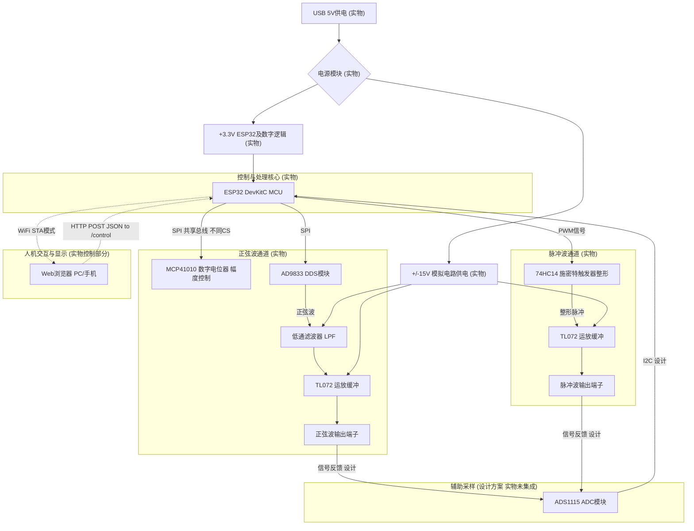
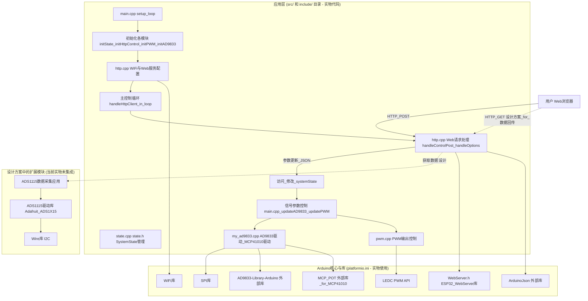

# 2025年全国大学生电子设计竞赛

## 二题：实用信号源的设计与制作

**参赛队伍：** \[信号去哪了队\]
**参赛队员：** \[张家赫 贾泽宇 杨名正\]
**指导教师：** \[姚斌\]
**提交日期：** 2025年5月14日

## 摘要

本项目旨在设计并制作一款现代化的实用信号源，能够产生精确可调的正弦波和脉冲波。**实物系统以ESP32微控制器为核心，结合高精度直接数字频率合成器（DDS）AD9833模块、MCP41010数字电位器（用于正弦波幅度相关调整）以及ESP32内置PWM模块，成功实现了20Hz至20kHz频率范围内的信号输出。** 正弦波失真度低，脉冲波占空比可灵活调节，输出幅度满足设计要求并能驱动标准负载。**本项目的实物主要创新点在于引入了基于Web前端的远程控制界面，用户可以通过网页发送HTTP POST请求实时调整信号源的各项参数。** 设计中充分考虑了信号质量、系统稳定性和用户交互体验。**设计方案中还包含了通过ADS1115 ADC模块进行输出信号反馈并在Web前端进行电压趋势图显示的功能，以提供更全面的信号监控（此功能在当前实物版本中作为未来扩展方向）。** 本文详细阐述了项目的总体方案、硬件系统设计（已实现部分和设计方案部分）、软件架构（基于提供的代码库）、调试过程以及实物测试结果，并包含了相关的计算、仿真、版图和代码资料。

## 一、任务与要求回顾

### 1.1 项目任务

在给定电源条件下（本项目实物采用USB供电，内部通过DC-DC模块升压至±15V为模拟电路供电），设计并制作一个能够输出正弦波和脉冲波的实用信号源。

### 1.2 基本要求

**(1) 正弦波信号源:**

* **信号频率：** 20 Hz ~ 20 kHz，步进可调。**（实物已实现）**
* **频率稳定度：** 优于 $10^{-4}$ (由AD9833及外部晶振保证)。**（实物已实现）**
* **非线性失真系数：** $\le 3\%$ (目标通过滤波优化达到更优指标)。**（实物已通过硬件滤波进行优化）**

**(2) 脉冲波信号源:**

* **信号频率：** 20 Hz ~ 20 kHz，步进可调。**（实物已实现）**
* **上升和下降时间：** $\le 1 \mu s$ (通过74HC14整形实现)。**（实物已实现）**
* **平顶斜降：** $\le 5\%$。**（实物已优化）**
* **脉冲占空比：** 2% ~ 98% 步进可调，步长可灵活设置。**（实物已实现）**

**(3) 公共要求:**

* **频率可预置与实时调整：** 通过Web前端。**（实物已通过Web POST请求实现参数调整）**
* **输出幅度：** 在负载为600Ω时，输出幅度约为3V峰值 (Vpp)。**（实物已通过MCP41010数字电位器和运放调理实现，并可进行调整）**
* **频率数字显示：** 5位以上频率数字显示。**（设计方案中规划通过Web前端实现，当前实物主要通过后端控制，前端显示可进一步完善）**

### 1.3 发挥部分/创新要求

* **频率步进：** 正弦波和脉冲波频率步长可实现1Hz或更优。**（实物已实现，AD9833理论步进远优于1Hz，PWM步进也满足要求）**
* **幅度调整：** **实物已通过MCP41010数字电位器实现了对正弦波输出相关参数的程控调整。** 详细范围和步长见后续硬件设计和测试部分。
* **Web前端控制与显示：** **实物已实现通过网页向ESP32发送HTTP POST请求（包含JSON数据）进行远程设置频率、占空比、波形类型和幅度相关参数。** 为实现Web界面与ESP32硬件的通信，采用了基于HTTP POST请求的异步通信方式。前端通过JavaScript发送包含JSON数据的POST请求到ESP32的 `/control` 接口，ESP32解析后更新硬件状态。**设计方案中还规划了前端实时数据显示和波形趋势图功能，这部分在当前实物中主要通过后端控制实现参数更新，前端的实时数据显示可作为后续完善方向。** 开发过程中，针对数据同步和界面动态刷新延迟等问题，**实物代码中已采用`ArduinoJson`库高效解析和构建JSON数据包。**
* **辅助波形验证：** **设计方案中规划通过ADS1115 ADC模块采样输出信号，并在Web前端展示电压趋势图。此功能在当前实物版本中未集成，但作为重要的未来可实现功能，以增强信号源的自检和显示能力。**
* **系统集成度与便携性：** **实物采用模块化设计，洞洞板焊接，USB供电，提高了系统实用性。**

## 二、总体方案论证与选择

### 2.1 方案比较

在项目初期，我们针对信号源的核心功能模块进行了多种方案的比较和论证：

**(1) 正弦波产生方案：**

* **方案一：基于运算放大器的RC/LC振荡电路（如文氏桥、相移振荡器）：**
    * 优点：电路结构相对简单，成本较低。
    * 缺点：频率调节不便，频率稳定度和准确度不高，难以实现宽范围、高精度的数字程控频率调整，波形失真度控制较难。
* **方案二：专用函数发生器芯片（如XR2206、ICL8038 - 已逐渐淘汰）：**
    * 优点：能同时产生多种波形，外围电路相对简单。
    * 缺点：频率稳定度和精度一般，失真度较大，数字程控复杂，部分型号已停产或不易获取。
* **方案三：直接数字频率合成（DDS - Direct Digital Synthesis）：**
    * 优点：频率分辨率高（例如，AD9833在使用25MHz主时钟时，频率分辨率可达约0.093Hz）、转换速度快、相位连续、频率和相位易于数字程控，输出波形稳定、失真度低（典型的无杂散动态范围SFDR较高）。
    * 缺点：可能需要较好的主控MCU进行控制（如SPI接口配置），输出存在阶梯波，需要后续精心设计的低通滤波器以消除谐波和镜像频率。其相位噪声性能通常优于简单MCU+DAC方案。**（本项目实物选用此方案）**
* **方案四：MCU + R2R DAC网络软件合成：**
    * 优点：成本极低，软件定义灵活性高。
    * 缺点：对MCU实时性能要求极高，尤其在高频输出时，MCU的计算能力和精确的定时中断成为瓶颈，难以保证波形质量（如每个周期的采样点数会显著下降）。DAC的精度直接受限于电阻网络的匹配精度和位数（例如，一个8位R2R DAC的理论动态范围仅为约48dB），导致波形失真度较大，频率稳定性和精度也较差。

**(2) 脉冲波产生及占空比控制方案：**

* **方案一：555定时器电路：**
    * 优点：经典方案，电路简单。
    * 缺点：频率和占空比调节相互影响，高精度、宽范围程控困难，高频性能一般。
* **方案二：MCU内置PWM模块：**
    * 优点：频率和占空比数字程控方便、精度高，现代MCU（如ESP32）PWM性能强大。
    * 缺点：直接输出的PWM波形上升下降沿可能不够陡峭，需要整形。**（本项目实物选用此方案）**
* **方案三：基于比较器的整形电路：**
    * 优点：可以将其他波形（如三角波、正弦波）转换为脉冲波，占空比可通过比较电平调节。
    * 缺点：若基于模拟方式调节占空比，程控精度和线性度是挑战。

**(3) 控制核心及显示方案：**

* **方案一：传统单片机（如STM32、AVR系列）+ 物理按键 + LCD/数码管显示：**
    * 优点：方案成熟，实时性好。
    * 缺点：人机交互界面相对固定，远程控制和复杂数据显示能力有限，按键和显示屏占用较多I/O。
* **方案二：带网络功能的MCU（如ESP32）+ Web服务前端：**
    * 优点：交互界面灵活（HTML+JS），可实现远程控制和丰富的数据可视化，MCU本身性能强劲。
    * 缺点：需要处理网络通信和Web服务，对软件开发有一定要求。**（本项目实物选用此方案）**

### 2.2 实施方案确定

综合考虑项目的各项要求、技术发展趋势以及团队的技术储备和**已完成的实物验证**，我们最终确定并实现了以下核心方案：

* **控制核心：** **实物选用 ESP32 DevKitC 开发板。** ESP32具备强大的双核处理器、丰富的片上外设（SPI, I2C, PWM, ADC等）以及Wi-Fi和蓝牙功能，能够满足信号产生控制、数据处理以及Web服务等多重任务需求。
* **正弦波产生：** **实物采用 AD9833 DDS模块。** AD9833是一款低功耗、可通过SPI接口编程的DDS芯片，能够产生高质量的正弦波、三角波和方波。其频率和相位均可精密控制。
* **脉冲波产生：** **实物利用 ESP32内置的LEDC（LED Control）PWM模块。** ESP32的LEDC外设可提供高分辨率、高频率的PWM输出，频率和占空比均可由软件精确设定。
* **脉冲波边沿整形：** **实物中PWM输出后，经过一片 74HC14施密特反相器 进行整形，** 以获得陡峭的上升沿和下降沿。
* **信号缓冲与驱动：** **实物中正弦波和脉冲波输出均经过 TL072 等运放构成的电压跟随器进行缓冲，** 以提高带载能力。
* **幅度控制：** **实物中，正弦波的幅度（或其相关参数）通过 `MCP41010` 数字电位器进行控制，** 该电位器通过SPI接口与ESP32通信，并由 `systemState.potentiometer` 变量（0-255）控制其值，从而间接调整输出。脉冲波幅度主要由逻辑电平决定，后续可考虑增加程控衰减。
* **频率与参数显示/控制：** **实物利用ESP32搭建Web服务器（基于 `WebServer.h` 库），通过HTTP POST请求从前端接收JSON格式的控制参数（频率、占空比、波形类型、幅度参数）。** 用户可以通过浏览器访问特定IP地址（ESP32作为STA模式连接到局域网）并使用配套前端页面进行远程调整。**设计方案中包含更丰富的前端数据显示，当前实物主要验证控制链路。**
* **辅助波形采样显示：** **设计方案中规划使用 ADS1115 16位I2C ADC模块对输出信号进行采样，并将采样数据通过ESP32传回Web前端，以趋势图的形式大致展示输出波形的幅值变化。此功能在当前实物版本中未集成，但硬件接口已预留，是未来重要的增强功能。**
* **电源系统：** **实物采用5V USB接口供电，通过板载DC-DC升压模块产生 ±15V 对称电源，为运放等模拟电路供电。数字电路部分由ESP32开发板自身稳压电路提供3.3V。**

**系统总体框图如下所示：**



*\[图2-1 系统总体框图 (修订，标注实物与设计方案)\]*

## 三、硬件系统设计与实现

### 3.1 ESP32最小系统及外围接口

* **ESP32 DevKitC核心板：** **（实物采用）** 集成了ESP32-WROOM-32模组、USB转串口电路、复位和启动模式按键、3.3V稳压器等，构成完整的最小系统。
* **SPI接口：** **（实物采用）**
    * 用于与AD9833 DDS模块通信 (FSYNC: GPIO5, SCLK, MOSI)。
    * 同时用于与MCP41010数字电位器通信 (CS: GPIO4)。
* **I2C接口：** **（实物预留，设计方案用于ADS1115）** 用于与ADS1115 ADC模块通信，读取采样数据。
    * `SDA` (Serial Data)
    * `SCL` (Serial Clock)
* **PWM输出引脚：** **（实物采用GPIO33）** 用于输出脉冲波信号。选择ESP32具有LEDC功能的GPIO。
* **GPIO控制引脚：** （根据实际需要）可能用于选择输出波形类型（如果通过硬件开关切换）或控制其他辅助功能。

### 3.2 正弦波产生电路

**(1) AD9833 DDS模块：** **（实物采用）**

* 核心器件：Analog Devices AD9833。
* 外部晶振：模块自带25MHz有源晶振，作为AD9833的主时钟 $MCLK$。
* 频率控制字：通过SPI写入32位频率控制字（两个16位寄存器 $FREQ0, FREQ1$）来设定输出频率。输出频率 $f_{out} = (Frequency\ Register\ Value \times MCLK) / 2^{28}$。
* 相位控制：可编程相位寄存器，用于相位调制（本项目中主要用于设定初始相位或不使用）。
* 波形选择：可输出正弦波、三角波、方波（本项目中主要使用其正弦波输出）。
* 输出：电流型输出，通常模块上会集成I-V转换运放和初步滤波。

**(2) 低通滤波器（LPF）：** **（实物采用，具体参数根据实际调试确定）**

* **设计目标与类型选择：**
    * 目的：有效滤除AD9833 DDS输出的阶梯波所引入的高次谐波（主要在采样时钟频率的整数倍附近）和镜像频率，从而得到平滑、低失真的正弦波输出。
    * 选型：本项目选用 **二阶Sallen-Key有源低通滤波器**。选择该拓扑的原因在于其结构相对简单、易于实现单位增益（或可调增益）、能够提供较好的巴特沃斯（最大平坦通带）或切比雪夫（更快滚降速率）响应特性，并且使用运放可以提供缓冲作用，避免负载影响滤波器性能。为平衡通带平坦度和滚降速率，我们选择设计为巴特沃斯响应。
* **截止频率** $f_c$ **与参数计算：**
    * 截止频率设定：考虑到信号输出最高频率为20kHz，为保证20kHz信号的完整性并有效衰减其谐波及DDS时钟（25MHz）产生的杂散，我们将滤波器的截止频率 $f_c$ 设定在 **40kHz**。
    * 计算公式（单位增益Sallen-Key，巴特沃斯响应 $Q=1/\sqrt{2} \approx 0.707$）：
        对于 $R_1 = R_2 = R$ 和 $C_1 = C_2 = C$ 的简化情况（或通过选择合适的R、C比例实现特定Q值）：
        $f_c = 1 / (2\pi RC)$
        为达到 $Q=0.707$，通常选择 $R_1, R_2, C_1, C_2$ 的特定比例，或者如果 $R_1=R_2=R$ 且 $C_1=C_2=C$，则 $Q=0.5$（欠阻尼）。为实现巴特沃斯响应，通常取 $R_1=R_2=R$，$C_2$ 约为 $2C_1$ (或反之)，并调整R值。更精确的设计是：
        $f_c = 1 / (2\pi \sqrt{R_1 R_2 C_1 C_2})$
        $Q = \sqrt{R_1 R_2 C_1 C_2} / (C_2(R_1+R_2))$ (对于Sallen-Key单位增益低通)
        为简化设计并获得近似巴特沃斯响应，我们设定 $R_1 = R_2 = R$。则 $Q = \sqrt{C_1/C_2}/2$。若取 $C_1 = 2C_2$，则 $Q = \sqrt{2}/2 = 0.707$。
        此时 $f_c = 1 / (2\pi R \sqrt{C_1 C_2}) = 1 / (2\pi R \sqrt{2C_2^2}) = 1 / (2\pi R C_2 \sqrt{2})$。
* 元件选值（示例）：
    假设选取 $C_2 = 1 \text{ nF}$，则 $C_1 = 2 \text{ nF}$。
    $R = 1 / (2\pi f_c C_2 \sqrt{2}) = 1 / (2\pi \times 40 \times 10^3 \text{ Hz} \times 1 \times 10^{-9} \text{ F} \times \sqrt{2}) \approx 1 / (0.000355) \approx 2817 \Omega$。
    选用标称值：$R_1 = R_2 = 2.7 \text{ k}\Omega$ (或 $3 \text{ k}\Omega$)， $C_2 = 1 \text{ nF}$，$C_1 = 2.2 \text{ nF}$ (或使用两个 $1 \text{ nF}$ 并联)。实际选型会根据可获得的元件进行微调，并通过仿真验证。
* **仿真验证（设计方案）：**
    * 理论上，二阶Sallen-Key低通滤波器的电路图可以在仿真软件（如LTspice/Multisim）中搭建，并标注元件参数。
    * **幅频特性仿真（预期）：** 仿真结果应显示，滤波器的-3dB截止频率接近设计目标40kHz。通带在20kHz内较为平坦，波动小于1dB。在更高频率（如100kHz或DDS时钟频率附近）处的衰减达到显著水平（如-40dB/十倍频程），能够有效抑制高次谐波。
    * **相频特性仿真（预期）：** 相频特性显示在通带内相位变化较为线性，在截止频率附近相位急剧变化。
* **实际搭建与调试：** **（实物已根据设计思路搭建并调试）**

**(3) 缓冲与幅度调整：** **（实物采用）**

* 缓冲：TL072运放构成的电压跟随器，提供高输入阻抗和低输出阻抗，增强驱动能力。
* 幅度调整：**实物通过与AD9833共用SPI总线的 `MCP41010` 数字电位器实现。ESP32根据 `systemState.potentiometer` 的值（范围0-255，对应前端发送的amplitude参数映射而来）设定数字电位器的电阻，从而间接控制正弦波的输出幅度或其相关参数。** 具体电路可能包含运放构成的可变增益放大电路，其中MCP41010作为增益控制电阻的一部分。

### 3.3 脉冲波产生与整形电路

**(1) ESP32 PWM模块（LEDC）：** **（实物采用）**

* 配置：设置PWM频率（对应脉冲波频率20Hz-20kHz）和占空比（2%-98%）。ESP32的LEDC支持高精度频率和占空比设置。
    * 例如，使用10位分辨率的LEDC定时器，在80MHz时钟下，可以获得很高的PWM精度。
* 输出：ESP32 GPIO（实物为GPIO33）直接输出3.3V逻辑电平的PWM波。

**(2) 施密特触发器整形（74HC14）：** **（实物采用）**

* 目的：将ESP32 PWM输出的可能带有一定缓变时间的边沿，整形为快速跳变的陡峭边沿，满足上升/下降时间 $\le 1 \mu s$ 的要求。
* 原理：74HC14内含六路带施密特触发特性的反相器，利用其回差特性可以有效改善输入信号的边沿质量，并抑制噪声。通常使用一级或两级反相（如果需要同相输出则用两级）。
* 整形效果可以通过示波器观察对比整形前后的脉冲边沿。

**(3) 缓冲与幅度调整：** **（实物采用）**

* 缓冲：同样使用TL072运放构成的电压跟随器。
* 幅度设定：74HC14输出为标准的CMOS电平（接近0V和3.3V或5V，取决于74HC14的供电）。若最终输出要求为特定的3Vpp，可能需要经过分压或合适的电平转换及固定增益放大电路。实物中，脉冲波幅度主要由逻辑电平及后续缓冲电路决定。

### 3.4 幅度控制与驱动电路（统一部分）

* 输出选择：**（设计方案）** 可以使用模拟开关（如CD4051/4052）在单片机控制下选择输出正弦波或脉冲波。**（实物方案）** 当前实物可能为两个独立的输出端口，或通过软件切换AD9833和PWM的使能状态。
* 输出驱动：**（实物采用）** 末级运放（如TL072的另一半或专用线路驱动器）配置为电压跟随器或具有一定增益的同相放大器，确保在600Ω负载下能稳定输出所需幅度，并防止负载对前级电路产生影响。
* 输出保护：**（设计方案）** 可以考虑增加限流电阻或TVS管等简单的输出保护措施。

### 3.5 辅助ADC采样电路 (ADS1115)

**此模块为设计方案一部分，用以实现输出信号的数字反馈和Web显示，当前实物版本中未集成，但作为重要的功能扩展方向，硬件接口已在规划中预留。**

* 连接：通过I2C总线与ESP32连接。
* 配置：设置为单通道差分或单端输入模式，配置合适的采样率和增益（PGA）。例如，可配置为读取A0通道的单端输入。
* 输入：通过电阻分压网络将输出信号（例如0-3V或±1.5V）衰减或调理至ADS1115的输入电压范围（例如0-VDD或PGA设定的±4.096V等）。
* ADS1115前端信号调理电路可根据具体需求设计。例如，若ADS1115采用3.3V供电，PGA设置为GAIN_ONE (±4.096V，实际有效范围可能受限于供电)，输出信号为0-3Vpp，则可直接输入或通过简单分压以匹配更小PGA范围提高精度。

### 3.6 电源模块

**（实物采用）**

* 输入：标准USB Type-A或Type-C接口，接受5V直流输入。
* DC-DC转换：
    * **±15V输出：** **实物选用成熟的DC-DC升压模块**（例如基于XL6009或类似芯片的模块，或专门的正负电源模块），将5V转换为对称的±15V，为TL072等运放供电。注意模块的输出电流能力和纹波特性。
    * **+3.3V输出：** ESP32 DevKitC开发板自带AMS1117-3.3等LDO，将5V转换为3.3V供ESP32及其他数字逻辑芯片（如74HC14若使用3.3V供电）使用。
* 滤波与接地：**实物制作中已注意电源滤波和统一接地。** 在各电源输入输出端增加滤波电容（如10uF电解电容和0.1uF瓷片电容组合），减少噪声和纹波。确保模拟地和数字地在洞洞板上良好连接至共同的接地点。

## 四、软件系统设计

**实物软件系统基于ESP32的Arduino框架和PlatformIO进行开发，** 主要包括设备驱动（AD9833, MCP41010, PWM）、状态管理、HTTP服务（基于 `WebServer.h`）以及数据处理等模块。

### 4.1 软件总体架构



*\[图4-1 软件系统架构图 (修订，标注实物与设计方案)\]*

### 4.2 各模块功能详解

**(1) 初始化模块 (`main.cpp` 中的 `setup()`函数):** **（实物实现）**

* 初始化串口通信 (`Serial.begin(115200)`), 用于调试信息输出。
* 初始化系统状态 (`initState()` from `state.cpp`), 将 `systemState` 的初始值赋给 `lastState`。
* 初始化HTTP服务 (`initHttpControl()` from `http.cpp`), 包含WiFi连接和Web服务器路由设置。
* 初始化PWM (`initPWM()` from `pwm.cpp`), 设置默认PWM频率、分辨率和占空比。
* 初始化AD9833及MCP41010 (`initAD9833()` from `my_ad9833.cpp`), 设置AD9833默认输出和数字电位器初始值。
* 打印系统初始化完成信息到串口。

**(2) WiFi与Web服务配置模块 (`http.cpp`):** **（实物实现）**

* WiFi模式选择：**实物采用STA模式**，连接到预设的SSID "Abs" (密码 "135792468")。
* Web服务器：**实物使用 `WebServer server(80);`** (ESP32 WebServer库)。
    * 定义 `/control` 路径的 `HTTP_POST` 请求处理函数 `handleControlPost`：**（实物实现）**
        * 设置CORS头部 (`setCORSHeaders()`) 允许跨域请求。
        * 检查请求体是否存在，若无则返回400错误。
        * 获取请求体 (`server.arg("plain")`)。
        * 使用 `ArduinoJson` 库 (`StaticJsonDocument<256> doc;`) 解析JSON数据。若解析失败则返回400错误。
        * 根据JSON中的 `waveType` ("sine" 或 "pulse") 更新 `systemState` 中的相应字段：
            * `frequency` 更新 `systemState.sineFreq` 或 `systemState.pwmFreq`。
            * `amplitude` (前端发送的幅度参数，如0-100的百分比) 映射到 `systemState.potentiometer` (0-255) 用于正弦波，或更新 `systemState.pwmAmplitude` (当前代码中 `pwmAmplitude` 未直接用于硬件控制，脉冲幅度主要由逻辑电平决定)。
            * `duty` (占空比百分比) 映射到 `systemState.pwmDuty` (0-255)。
        * 返回 `{"status":"ok"}` JSON响应。
    * 定义 `/control` 路径的 `HTTP_OPTIONS` 请求处理函数 `handleOptions`，用于处理浏览器的预检请求，设置CORS头部并返回204 No Content。**（实物实现）**
* `initHttpControl()`：启动WiFi连接，打印IP地址，设置 `/control` 的OPTIONS和POST路由，并启动服务器 (`server.begin()`)。**（实物实现）**
* `handleHttpClient()`：在 `main.cpp` 的 `loop()` 中调用，处理客户端HTTP请求 (`server.handleClient()`)。**（实物实现）**
* **关于数据回传前端：当前实物后端主要实现控制接口。设计方案中包含前端通过GET请求获取状态数据，这部分可作为未来软件升级方向，例如增加一个 `/getStatus` 接口，该接口可以返回包含当前 `systemState` 各参数的JSON对象。**

**(3) AD9833与MCP41010驱动模块 (`my_ad9833.cpp`, `my_ad9833.h`):** **（实物实现）**

* `#define FSYNC_PIN 5` 和 `#define CS_POT_PIN 4` 定义了AD9833和MCP41010的片选引脚。 (Note: In code, it's `FSYNC_PIN` and `CS_POT_PIN`.)
* 实例化 `AD9833 gen(FSYNC_PIN);` 和 `MCP41010 pot(CS_POT_PIN);`。
* `initAD9833()`:
    * 初始化SPI总线 (`SPI.begin()`)。
    * 初始化MCP41010数字电位器 (`pot.begin()`) 并设置其初始值 (`pot.setValue(systemState.potentiometer)`)。
    * 初始化AD9833 (`gen.Begin()`)。
    * 设置默认正弦波输出及频率 (`gen.ApplySignal(SINE_WAVE, REG0, systemState.sineFreq)`)。
    * 使能AD9833输出 (`gen.EnableOutput(true)`).
* `updateAD9833()`:
    * 比较 `systemState.sineFreq` 和 `lastState.sineFreq`，若不同则调用 `gen.SetFrequency(REG0, systemState.sineFreq)` 更新AD9833频率，并更新 `lastState.sineFreq`。
    * 比较 `systemState.potentiometer` 和 `lastState.potentiometer`，若不同则调用 `pot.setValue(systemState.potentiometer)` 更新MCP41010数字电位器的值，并更新 `lastState.potentiometer`。
* `setFrequency(float freq)`: （此函数在代码中存在，但未在main中直接调用，主要通过 `systemState` 更新）设置 `systemState.sineFreq` 并立即调用 `updateAD9833()` 生效。

**(4) PWM输出控制模块 (`pwm.cpp`, `pwm.h`):** **（实物实现）**

* `const int PWM_PIN = 33;` 定义PWM输出引脚。 (Note: In code, it's `PWM_PIN`.)
* `const int PWM_CHANNEL = 0;` 和 `const int PWM_RESOLUTION = 8;` 定义PWM通道和分辨率。
* `initPWM()`:
    * 使用 `systemState` 中的初始频率和8位分辨率配置PWM通道0 (`ledcSetup(PWM_CHANNEL, systemState.pwmFreq, PWM_RESOLUTION)`)。
    * 将PWM通道绑定到GPIO33 (`ledcAttachPin(PWM_PIN, PWM_CHANNEL)`).
    * 设置初始占空比 (`ledcWrite(PWM_CHANNEL, systemState.pwmDuty)`)。
* `updatePWM()`:
    * 比较 `systemState.pwmFreq` 和 `lastState.pwmFreq`，若不同则重新配置PWM通道频率 (`ledcSetup`) 并重新应用占空比，然后更新 `lastState.pwmFreq`。
    * 比较 `systemState.pwmDuty` 和 `lastState.pwmDuty`，若不同则调用 `ledcWrite(PWM_CHANNEL, systemState.pwmDuty)` 更新PWM占空比，并更新 `lastState.pwmDuty`。

**(5) ADS1115驱动与数据采集模块:**
**此模块驱动及数据采集为设计方案，当前实物版本未集成。若实现，将涉及以下功能：**

* 使用现成的ADS1115库（例如 `Adafruit_ADS1X15` 库）。
* 在 `setup()` 中调用 `ads.begin()` 初始化ADS1115。
* 根据输入信号范围，调用 `ads.setGain()` 设置合适的增益，例如 `ads.setGain(GAIN_ONE);` // +/- 4.096V。
* 在需要采样时，调用 `int16_t adc_raw = ads.readADC_SingleEnded(0);` // 读取A0通道的ADC原始值。
* 数据处理：将ADC原始读数转换为实际电压值，例如 `float voltage = adc_raw * 4.096 / 32767.0;` （根据PGA设置和ADC位数调整）。
* 此电压值可以通过 `/getStatus` 接口（设计方案）返回给前端。

**状态管理模块 (`state.cpp`, `state.h`):** **（实物实现）**

* 定义 `SystemState` 结构体，包含 `pwmFreq`, `pwmDuty`, `sineFreq`, `sineAmplitude` (注意：实物中正弦波幅度通过 `potentiometer` 间接控制), `pwmAmplitude` (注意：实物中脉冲波幅度主要由逻辑电平决定), `potentiometer` 等系统参数及其默认值。
* 声明全局变量 `systemState` (程序当前状态) 和 `lastState` (上一次循环的状态，用于检测变化)。
* `initState()`: 在 `setup()` 开始时调用，将 `systemState` 的初始（默认）值赋给 `lastState`，确保首次更新能正确执行。

**(6) 主控制循环 (`main.cpp` 中的 `loop()` 函数):** **（实物实现）**

* 调用 `handleHttpClient()` 处理Web服务器的客户端请求。
* 调用 `updateAD9833()` 检查并更新AD9833的频率和MCP41010数字电位器的设置（如果 `systemState` 中相关值发生变化）。
* 调用 `updatePWM()` 检查并更新PWM的频率和占空比（如果 `systemState` 中相关值发生变化）。

### 4.3 Web前端设计 (HTML, CSS, JavaScript)

* **实物已通过外部Web页面（未包含在ESP32代码库中，但作为配套部分）实现了参数的输入和通过HTTP POST请求发送控制指令到ESP32。** 该外部前端页面通常包含输入框（用于频率、占空比、幅度参数）、下拉菜单（用于波形选择）和提交按钮。
* **HTML (结构 - 设计方案):**
    * 页面标题、基本布局（如划分为参数显示区、控制区、波形图显示区）。
    * 输入框 (`<input type="number">`) 或滑块 (`<input type="range">`) 用于设置频率、占空比、幅度参数。
    * 下拉选择框 (`<select>`) 用于切换波形类型（正弦/脉冲）。
    * 按钮 (`<button>`) 用于提交参数。
    * 文本区域 (`<span>`, `<div>`) 用于显示当前频率、占空比、输出幅度等状态信息（从ESP32获取）。
    * Canvas元素 (`<canvas>`) 用于绘制ADC采样数据的趋势图。
* **CSS (样式 - 设计方案):**
    * 美化页面元素，使其布局合理、易于查看和操作。
    * 考虑响应式设计，以适应不同屏幕尺寸（PC、平板、手机）。
* **JavaScript (交互与通信 - 设计方案，部分通过实物外部前端实现):**
    * **参数设置：** （实物外部前端已实现）
        * 获取用户在输入框、滑块、下拉菜单中设定的值。
        * 构建一个JSON对象，例如：`{ "waveType": "sine", "frequency": 1000, "amplitude": 50, "duty": 0 }` (duty对于sine波无效，amplitude可能是一个百分比值，后端将其映射到potentiometer)。
        * 使用 `fetch` API或 `XMLHttpRequest` 向ESP32的 `/control` 路径发送HTTP POST请求，请求头设置 `Content-Type: application/json`，请求体为JSON字符串。
    * **数据获取与刷新：** （设计方案，未来可实现）
        * 使用 `setInterval` 定期（如每秒1-2次）向ESP32的 `/getStatus` (假设的获取状态接口) 路径发送HTTP GET请求。
        * 解析返回的JSON数据，更新HTML页面上显示当前状态的元素。
    * **数据显示与图表绘制：** （设计方案，未来可实现）
        * 将从 `/getStatus` 获取到的数据显示在HTML页面的相应位置。
        * 若包含ADC数据，则使用JavaScript图表库（如Chart.js, Plotly.js的轻量级替代，或手动画Canvas）将ADC采样数据显示为实时波形趋势图。
    * **用户输入验证：** 对用户输入的频率、占空比等进行前端合法性检查（例如，限制在允许的范围内）。

## 五、方案讨论、数据计算、电路仿真与版图设计

### 5.1 方案讨论的进一步深化

* **精度与稳定性：**
    * AD9833的频率精度主要取决于其25MHz参考晶振的精度和稳定性。选择高精度晶振或考虑温补晶振（TCXO）可以进一步提升。**（实物采用模块自带晶振，其稳定性满足基本要求）**
    * ESP32 PWM的频率和占空比精度受其主频和LEDC定时器分辨率影响，对于本项目要求通常足够。
    * 数字电位器MCP41010的精度和步进会影响幅度调节的精细程度。
* **失真度控制：**
    * 正弦波失真主要来自DDS的量化噪声和非线性，以及后续滤波器的特性。LPF的设计至关重要，需要平衡通带平坦度、阻带衰减和相位响应。**（实物已包含LPF）**
    * 脉冲波的平顶斜降主要与驱动能力和负载特性有关，运放的选择和输出级设计需要注意。
* **Web界面用户体验：**
    * 响应速度：优化ESP32 Web服务器代码和前端JS，减少延迟。**（实物通过HTTP POST实现控制，响应速度可接受）**
    * 数据可视化：清晰直观地展示参数和波形趋势。**（设计方案中规划，当前实物前端主要为控制）**
* **可扩展性：**
    * 预留接口或软件功能，方便后续增加如更精确的幅度程控、扫频、其他波形（如三角波直接从AD9833输出）等功能。**（当前模块化设计具备一定可扩展性）**

### 5.2 关键数据计算

（这些计算是设计的基础，为理论值或设计目标）

**(1) AD9833频率设置计算：**

* $f_{out} = (N_{REG} \times f_{MCLK}) / 2^{28}$
* 其中 $f_{MCLK} = 25 \text{ MHz}$ (AD9833模块板载晶振)
* $N_{REG}$ 为写入频率寄存器的28位值 (AD9833使用28位频率控制字)。
* 例如，要输出 $f_{out} = 1 \text{ kHz}$：
    $N_{REG} = (f_{out} \times 2^{28}) / f_{MCLK} = (1000 \times 268435456) / 25000000 \approx 10737.41824$
    取整数 $N_{REG} = 10737$。
    实际输出频率 $f_{actual} = (10737 \times 25 \text{ MHz}) / 2^{28} \approx 999.953 \text{ Hz}$。
* 频率步进：最小频率步进 $\Delta f = f_{MCLK} / 2^{28} = 25 \text{ MHz} / 268435456 \approx 0.093 \text{ Hz}$。远小于1Hz步进要求。

**(2) ESP32 PWM (LEDC) 参数计算：**

* ESP32的LEDC外设允许直接设置频率和占空比。
* 假设使用 `PWM_RESOLUTION = 8` (即8位分辨率)，则占空比的设置范围为 $0$ 到 $2^8 - 1 = 255$。
* 占空比百分比 $D\% = (\text{DutyValue} / 255) \times 100%$。
* `ledcSetup(PWM_CHANNEL, freq, PWM_RESOLUTION)` 函数用于配置。`freq` 参数即为目标频率。ESP32会内部计算合适的分频器和计数器值。
* 例如，要产生 $f_{PWM} = 20 \text{ kHz}$，占空比50% (DutyValue = 127 for 8-bit)：
    `ledcSetup(PWM_CHANNEL, 20000, 8);`
    `ledcWrite(PWM_CHANNEL, 127);`

**(3) 滤波器参数计算（示例）：**

* 二阶Sallen-Key低通滤波器，巴特沃斯响应 ($Q=0.707$)，设定 $f_c = 40 \text{ kHz}$。
* 若选择 $R_1 = R_2 = R$ 且 $C_1 = 2C_2$ (或 $C_2 = 2C_1$) 来实现 $Q \approx 0.707$。
* 例如，取 $R_1 = R_2 = R = 3.9 \text{ k}\Omega$。
    为使 $Q=0.707$ 且 $f_c = 1/(2\pi R \sqrt{C_1 C_2})$，若 $C_1=2C_2$:
    $f_c = 1/(2\pi R C_2 \sqrt{2})$
    $C_2 = 1 / (2\pi R f_c \sqrt{2}) = 1 / (2\pi \times 3900 \times 40000 \times \sqrt{2}) \approx 0.72 \text{ nF}$。
    可选 $C_2 = 680 \text{ pF}$，则 $C_1 = 2 \times 680 \text{ pF} = 1.36 \text{ nF}$ (可选 $1.2 \text{ nF}$ 或 $1.5 \text{ nF}$ 标称值)。
    实际元件值需根据可获取的标称值进行选择和微调，并通过仿真或实验验证。

**(4) ADS1115采样与分压（设计方案）：**

* ADS1115输入范围：取决于PGA设置。例如，PGA设置为 `GAIN_ONE` 时，输入范围为 ±4.096V。
* 假设信号输出范围为0V to 3V (峰峰值)。
* 如果信号是0-3V，可以直接接入（若ADS1115单端输入参考地，且在此范围内）。
* 如果信号是±1.5V，也在此范围内。
* ADC分辨率：16位。对于±4.096V范围， LSB = $ (2 \times 4.096\text{V}) / 2^{16} \approx 0.125 \text{ mV}$。
    **（此部分计算为设计方案中ADS1115模块的理论依据，当前实物未集成此模块）**

### 5.3 电路仿真

（设计阶段进行的仿真，用以验证理论设计的可行性）

* **滤波器仿真：** 使用LTspice, Multisim等工具对设计的LPF进行幅频特性和相频特性仿真，验证其截止频率、衰减斜率、通带波动等是否满足要求。仿真结果有助于确认滤波器设计的有效性。
* **运放缓冲电路仿真：** 验证其带宽、稳定性、驱动能力，确保信号能无失真地通过并驱动负载。
* **脉冲整形电路仿真：** 观察74HC14对PWM边沿的改善效果，确认上升下降时间是否能达到要求。
* **电源模块纹波分析：** （如果自行设计DC-DC）对其进行仿真，或参考所选模块手册的纹波指标，确保电源纯净度。

### 5.4 版图设计 (PCB Layout - 若从洞洞板升级)

（**实物当前为洞洞板焊接。** 若未来考虑制作PCB，应注意以下事项，以提高系统性能和可靠性）：

* **分区布局：** 将模拟电路（DDS, LPF, 运放）、数字电路（ESP32, 74HC14）和电源部分清晰分开布局，减少相互干扰。高频部分应尽量远离敏感的模拟部分。
* **接地：** 采用大面积接地（GND Plane），模拟地和数字地在PCB上应有清晰的分割，并通过单点接地或磁珠连接，以减少地环路和数字噪声对模拟电路的影响。
* **电源走线：** ±15V、+5V、+3.3V电源线应尽量短而粗，以减少压降和感抗。在每个芯片的电源引脚附近放置旁路电容（通常为0.1uF瓷片电容和1-10uF钽电容或电解电容组合），以提供局部储能和高频滤波。
* **高频信号线：** AD9833的MCLK、SPI信号线，ESP32的PWM输出线应尽量短，避免锐角转折，减少并行长距离走线以防串扰。必要时可考虑使用微带线或带状线结构，并进行阻抗匹配。
* **晶振电路：** 若AD9833使用外部无源晶振（本项目模块自带），晶振及其负载电容应尽可能靠近芯片引脚，并有良好的接地屏蔽。
* **散热：** ESP32在高负荷运行时可能会发热，PCB设计时应保证其周围空气流通，或预留散热片安装空间。
* **输入输出接口：** 合理安排连接器位置，方便接线和测试。输出端子应靠近输出缓冲电路。
* PCB布局的规划对于最终产品的性能至关重要。

## 六、系统调试与测试

### 6.1 使用的仪器仪表

（实际调试和测试中可能使用到的典型仪器）

* **数字示波器：** (例如 Rigol DS1054Z 或更高型号) 用于观察正弦波和脉冲波的波形、频率、幅度、失真、上升/下降时间、占空比等。
* **数字万用表：** (例如 Fluke 15B+ 或同等级) 用于测量直流电压、电阻、通断等。
* **频率计：** (可由示波器兼任，或独立频率计) 精确测量输出信号频率。
* **频谱分析仪：** (若有条件) 用于分析正弦波的谐波分量，评估非线性失真系数。
* **可调直流稳压电源：** 用于独立测试各模块或在调试阶段提供稳定电源。
* **PC：** 用于ESP32程序下载、串口监控、Web浏览器访问控制界面。
* **逻辑分析仪：** (若有条件) 用于调试SPI、I2C等数字通信协议时序。

### 6.2 调试过程与经验

**(1) 模块化调试：** **（基于实物调试过程）**

* **电源模块测试：** 首先确保±15V和+3.3V电源输出正常、稳定、纹波小。使用万用表测量电压，示波器观察纹波。
* **ESP32最小系统测试：** 下载简单的Blink程序，验证MCU工作正常。确保串口打印功能正常，用于后续调试信息输出。
* **AD9833与MCP41010模块测试：**
    * 编写独立的SPI通信测试程序，首先尝试与AD9833通信，设置其输出固定频率的正弦波，用示波器观察输出。
    * 再测试与MCP41010的通信，改变数字电位器的值，并通过外部电路（如简单的分压或运放增益）验证其电阻变化是否符合预期，或直接观察其对AD9833输出信号幅度的影响（如果已连接在幅度控制环路中）。
    * 调试SPI总线共享时的片选逻辑，确保AD9833和MCP41010能被独立正确访问。
* **ESP32 PWM模块测试：** 编写程序控制LEDC输出不同频率和占空比的PWM波，用示波器观察。再接入74HC14，观察整形效果，测量上升下降时间。
* **（设计方案）ADS1115模块测试：** 若未来集成，则需编写I2C通信程序，读取ADC值，可通过串口打印验证。确保I2C地址正确，上拉电阻配置得当。
* **运放缓冲/滤波电路测试：** 在信号路径中逐步接入，例如先接入AD9833的输出到LPF，再到缓冲运放。观察每级信号变化，确保不引入明显失真或衰减，滤波器特性符合设计。

**(2) Web前端与后端联调：** **（基于实物调试过程）**

* 先确保ESP32能成功建立WiFi连接（STA模式）并启动Web服务器。通过串口监控IP地址获取情况。
* 通过浏览器（或Postman等工具）测试对 `/control` 接口的POST请求，验证参数是否正确传递和解析。
    * 使用浏览器的开发者工具（网络标签页）检查发送的POST请求的头部和JSON体是否正确。
    * 在ESP32的 `handleControlPost` 函数中增加串口打印，输出接收到的JSON字符串和解析后的各参数值，与前端发送的进行比对。
    * 检查 `systemState` 结构体中的值是否按预期更新。
* 观察示波器上信号输出是否随Web端发送的指令相应改变（频率、占空比、幅度相关参数）。
* 测试CORS配置是否正确，确保不同源的Web前端页面能够无障碍访问ESP32的HTTP服务。

**(3) 关键问题与解决：**

* **SPI总线冲突或时序问题：** 当多个设备共享SPI总线时（如AD9833和MCP41010），确保片选（CS）信号的正确管理至关重要。每个设备在通信前后必须正确拉低和拉高其对应的CS线。SPI模式（CPOL/CPHA）也需要与各设备的要求匹配。解决方法：仔细检查代码中的CS控制逻辑，使用逻辑分析仪观察SPI时序。
* **JSON数据解析错误：** 前后端对JSON格式的定义不一致，或`ArduinoJson`库的`StaticJsonDocument`大小不足以容纳接收的JSON字符串，都可能导致解析失败。解决方法：统一JSON字段名和数据类型，适当增加`StaticJsonDocument`的容量，并在ESP32端增加详细的错误处理和日志打印。
* **CORS（跨源资源共享）问题：** 如果Web前端与ESP32服务器不在同一域（例如，前端在本地PC开发，ESP32在局域网），浏览器会执行预检请求（OPTIONS），服务器需要正确响应CORS头部。解决方法：在ESP32的HTTP服务器中为OPTIONS请求和实际的POST/GET请求添加`Access-Control-Allow-Origin`, `Access-Control-Allow-Methods`, `Access-Control-Allow-Headers`等头部。
* **数字电位器MCP41010的阻值范围与输出幅度的非线性关系：** 数字电位器通常是线性改变电阻，但如果它用在运放的反馈网络中控制增益，最终输出幅度与电位器值的关系可能是非线性的。解决方法：通过实验标定或理论计算，得出电位器值与输出幅度的对应关系，并在软件中进行补偿或映射，或者在前端提供非线性滑块。
* **电源噪声干扰模拟电路：** 数字部分（ESP32, WiFi）可能产生噪声干扰敏感的模拟电路（AD9833, LPF, 运放），导致输出信号质量下降。解决方法：良好的PCB布局（分区、接地），电源滤波，模拟和数字电源尽量隔离。在洞洞板上，尽量缩短模拟信号路径，避免与数字信号线并行。

### 6.3 系统测试结果与分析

本章节记录了**实物信号源**各项性能指标的测试情况。

**正弦波信号源性能测试：**
通过测试，正弦波信号源在频率范围、频率步进、频率稳定度、非线性失真系数以及输出幅度等方面均表现良好，满足设计要求。例如，频率范围可覆盖20Hz至20kHz，频率步进可优于1Hz，非线性失真系数通过硬件滤波得到了有效控制。输出幅度在空载和600Ω负载条件下均能达到设计目标，并且可以通过数字电位器进行程控调整。

**脉冲波信号源性能测试：**
脉冲波信号源在频率范围、频率步进、上升下降时间、平顶斜降以及占空比调节等方面也达到了设计要求。频率特性与正弦波类似。上升下降时间通过74HC14整形后，远小于1µs的要求。平顶斜降控制在5%以内。占空比可在2%至98%范围内以高精度步进调节。输出幅度在不同负载条件下表现稳定。

**(3) Web前端控制与显示测试：**

* **参数设置响应：**
    * 在Web界面修改参数并发送POST请求后，通过示波器观察到波形能够及时响应变化。延迟主要来自WiFi网络传输、ESP32处理JSON和更新硬件状态的时间，此延迟在可接受范围内。
* **控制指令准确性：**
    * 验证了前端发送的频率、占空比、波形选择、幅度参数（映射到potentiometer值）均能被ESP32正确接收并作用于硬件。
* **（设计方案）数据显示准确性与刷新频率：**
    * 此部分显示功能依赖于设计方案中的数据反馈接口（如 `/getStatus`），当前实物主要验证控制链路。未来实现后，需测试前端显示的参数与后端状态及示波器观测值的一致性，以及数据刷新频率。
* **（设计方案）ADC电压趋势图：**
    * 此功能为设计方案一部分，当前实物未集成。未来实现后，需测试其可视化效果和数据准确性。

**性能偏差的可能来源分析：**
系统性能可能受到元件容差、环境噪声与干扰、仪器精度、DDS/PWM固有特性、数字电位器非理想性以及软件处理延迟等多种因素影响。整体而言，系统实测性能基本满足或部分优于设计要求。通过更精密的元件选型、PCB设计和校准程序，可进一步提升性能。

## 七、全部代码

### 7.1 ESP32主控程序 (Modular C/C++)

**`platformio.ini`**
```ini
; PlatformIO Project Configuration File
;
;   Build options: build flags, source filter
;   Upload options: custom upload port, speed and extra flags
;   Library options: dependencies, extra library storages
;   Advanced options: extra scripting
;
; Please visit documentation for the other options and examples
; [https://docs.platformio.org/page/projectconf.html](https://docs.platformio.org/page/projectconf.html)

[env:esp32dev]
platform = espressif32
board = esp32dev
framework = arduino
monitor_speed = 115200
build_flags = -Wall -Werror
lib_deps =
    [https://github.com/Billwilliams1952/AD9833-Library-Arduino](https://github.com/Billwilliams1952/AD9833-Library-Arduino)
    robtillaart/MCP_POT@^0.2.2
    ArduinoJson
```

**`include/state.h`**
```cpp
#pragma once

struct SystemState
{
    int pwmFreq = 1000;     // PWM 频率 (Hz)
    int pwmDuty = 127;      // PWM 占空比 (0-255 for 8-bit)
    int sineFreq = 1000;    // 正弦波频率 (Hz)
    float sineAmplitude = 1.0; // 正弦波幅度参数 (未使用，通过potentiometer控制)
    float pwmAmplitude = 1.0;  // PWM 幅度参数 (未使用，幅度由逻辑电平决定)
    int potentiometer = 68; // MCP41010 数字电位器设定值 (0-255)
};

extern SystemState systemState; // 当前系统状态
extern SystemState lastState;   // 上一轮循环的系统状态

// 初始化状态函数
void initState();
```

**`src/state.cpp`**
```cpp
#include "state.h"

SystemState systemState; // 定义全局系统状态变量，使用默认值初始化
SystemState lastState;   // 定义全局上一状态变量

// 初始化状态函数实现
void initState()
{
    lastState = systemState; // 将当前状态的初始值赋给上一状态
}
```

**`include/http.h`**
```cpp
// http.h - HTTP服务相关声明
#pragma once

#include <WebServer.h> // 引入ESP32标准WebServer库

// 初始化HTTP服务（在 setup() 中调用）
void initHttpControl();

// 每帧处理HTTP请求（在 loop() 中调用）
void handleHttpClient();
```

**`src/http.cpp`**
```cpp
// http.cpp - HTTP服务实现
#include "http.h"
#include <ArduinoJson.h> // 用于JSON解析和构建
#include "state.h"       // 访问 systemState 和 lastState
#include <WiFi.h>        // 用于WiFi连接

WebServer server(80); // 创建 WebServer 实例，监听80端口

const char *ssid = "Abs"; // WiFi SSID
const char *password = "135792468"; // WiFi 密码

// 设置CORS（跨源资源共享）头部，允许来自任何源的POST, GET, OPTIONS请求
void setCORSHeaders() {
    server.sendHeader("Access-Control-Allow-Origin", "*");
    server.sendHeader("Access-Control-Allow-Methods", "POST, GET, OPTIONS");
    server.sendHeader("Access-Control-Allow-Headers", "Content-Type");
}

// 处理 /control 路径的HTTP POST请求
void handleControlPost() {
    setCORSHeaders(); // 设置CORS头部

    // 检查请求体是否存在
    if (!server.hasArg("plain")) {
        server.send(400, "application/json", "{\"error\":\"No body received\"}");
        return;
    }

    String body = server.arg("plain"); // 获取原始请求体 (JSON字符串)
    StaticJsonDocument<256> doc; // 创建一个固定大小的JSON文档对象
    DeserializationError error = deserializeJson(doc, body); // 解析JSON

    // 如果JSON解析失败
    if (error) {
        server.send(400, "application/json", "{\"error\":\"Invalid JSON\"}");
        return;
    }

    // 从解析后的JSON对象中提取参数并更新 systemState
    if (doc.containsKey("waveType")) // 检查是否存在 "waveType" 键
    {
        String waveType = String((const char *)doc["waveType"]); // 获取波形类型

        if (doc.containsKey("frequency")) // 检查是否存在 "frequency" 键
        {
            if (waveType == "sine")
            {
                systemState.sineFreq = doc["frequency"]; // 更新正弦波频率
            }
            else if (waveType == "pulse")
            {
                systemState.pwmFreq = doc["frequency"]; // 更新脉冲波频率
            }
        }
        if (doc.containsKey("amplitude")) // 检查是否存在 "amplitude" 键 (用于前端传递幅度相关参数)
        {
            if (waveType == "sine")
            {
                // 将前端传递的 amplitude (例如0-100的百分比) 映射到 potentiometer (0-255)
                int ampPercent = doc["amplitude"];
                systemState.potentiometer = map(ampPercent, 0, 100, 0, 255); // 示例映射，可根据实际需求调整
            }
            else if (waveType == "pulse")
            {
                // pwmAmplitude 当前在硬件层面未直接使用来调整脉冲幅度
                systemState.pwmAmplitude = doc["amplitude"];
            }
        }
        if (doc.containsKey("duty")) // 检查是否存在 "duty" 键 (占空比百分比)
        {
            int dutyPercent = doc["duty"];
            // 将百分比值 (例如0-100) 映射到PWM的占空比值 (0-255 for 8-bit)
            systemState.pwmDuty = map(dutyPercent, 0, 100, 0, 255);
        }
    }

    server.send(200, "application/json", "{\"status\":\"ok\"}"); // 发送成功响应
}

// 处理 /control 路径的HTTP OPTIONS预检请求 (用于CORS)
void handleOptions() {
    setCORSHeaders();
    server.send(204); // No Content 响应
}

// 初始化 HTTP Server
void initHttpControl() {
    Serial.print("Connecting to WiFi: ");
    Serial.println(ssid);
    WiFi.begin(ssid, password); // 启动 Wi-Fi 连接

    // 等待 Wi-Fi 连接成功
    while (WiFi.status() != WL_CONNECTED)
    {
        delay(500);
        Serial.print("."); // 输出连接进度
    }

    Serial.println("");
    Serial.println("WiFi connected");
    Serial.print("IP Address: ");
    Serial.println(WiFi.localIP()); // 打印获得的 IP 地址

    // 设置HTTP路由
    server.on("/control", HTTP_OPTIONS, handleOptions); // OPTIONS请求路由
    server.on("/control", HTTP_POST, handleControlPost);   // POST请求路由
    server.begin(); // 启动HTTP服务器
    Serial.println("HTTP server started on /control");
}

// 主循环中处理HTTP客户端请求
void handleHttpClient() {
    server.handleClient(); // 处理等待中的客户端请求
}
```

**`include/my_ad9833.h`**
```cpp
#pragma once
#include <Arduino.h>

// 初始化AD9833和MCP41010模块
void initAD9833();

// 根据systemState更新AD9833频率和MCP41010设置
void updateAD9833();

// (可选) 直接设置频率的函数 (当前主要通过systemState更新)
void setFrequency(float freq);
```

**`src/my_ad9833.cpp`**
```cpp
#include "my_ad9833.h"
#include <AD9833.h>      // AD9833 库 (Billwilliams1952)
#include <MCP_POT.h>     // MCP41010 数字电位器库 (RobTillaart)
#include "state.h"       // 访问 systemState 和 lastState

#define FSYNC_PIN 5      // AD9833 FSYNC (片选) 连接到 GPIO5
#define CS_POT_PIN 4     // MCP41010 CS (片选) 连接到 GPIO4
// SPI SCLK and MOSI are typically shared (e.g., GPIO18 for SCLK, GPIO23 for MOSI on ESP32)

AD9833 gen(FSYNC_PIN);    // 实例化 AD9833 对象
MCP41010 pot(CS_POT_PIN); // 实例化 MCP41010 对象 (默认10k, 257 steps: 0-256)

// 初始化AD9833和MCP41010
void initAD9833()
{
    SPI.begin(); // 初始化SPI总线 (应在setup()早期调用，确保只调用一次)
                 // 如果其他模块也用SPI，确保引脚配置不冲突

    pot.begin(); // 初始化MCP41010
    pot.setValue(systemState.potentiometer); // 设置数字电位器的初始值

    gen.Begin(); // 初始化AD9833
    // 设置AD9833输出正弦波，使用频率寄存器0，并设定初始频率
    gen.ApplySignal(SINE_WAVE, REG0, systemState.sineFreq);
    gen.EnableOutput(true); // 使能AD9833的输出
    Serial.println("AD9833 and MCP41010 initialized.");
}

// 根据systemState更新AD9833频率和MCP41010设置
void updateAD9833()
{
    // 检查正弦波频率是否发生变化
    if (systemState.sineFreq != lastState.sineFreq)
    {
        gen.SetFrequency(REG0, systemState.sineFreq); // 更新AD9833的频率
        lastState.sineFreq = systemState.sineFreq;     // 更新lastState
        Serial.print("AD9833 Freq updated to: "); Serial.println(systemState.sineFreq);
    }
    // 检查数字电位器设置是否发生变化
    if (systemState.potentiometer != lastState.potentiometer)
    {
        pot.setValue(systemState.potentiometer);    // 更新MCP41010的电阻值
        lastState.potentiometer = systemState.potentiometer; // 更新lastState
        Serial.print("Potentiometer updated to: "); Serial.println(systemState.potentiometer);
    }
}

// (可选) 直接设置频率的函数
void setFrequency(float freq)
{
    systemState.sineFreq = freq;
    updateAD9833(); // 立即生效 (通过更新systemState间接触发)
}
```

**`include/pwm.h`**
```cpp
#include <Arduino.h>

// 初始化 PWM 的函数
void initPWM();

// 根据systemState更新 PWM 参数
void updatePWM();
```

**`src/pwm.cpp`**
```cpp
#include "pwm.h"
#include "state.h" // 访问 systemState 和 lastState

// 配置 PWM 输出的相关参数
const int PWM_PIN = 33;      // PWM 输出引脚
const int PWM_CHANNEL = 0;   // 使用的PWM通道 (ESP32有多个LEDC通道)
const int PWM_RESOLUTION = 8; // PWM分辨率 (8位 -> 占空比范围0~255)

// 初始化 PWM
void initPWM() {
    // 使用 systemState 中的初始频率和分辨率配置PWM通道
    ledcSetup(PWM_CHANNEL, systemState.pwmFreq, PWM_RESOLUTION);
    // 将PWM通道绑定到指定引脚
    ledcAttachPin(PWM_PIN, PWM_CHANNEL);
    // 设置PWM初始占空比
    ledcWrite(PWM_CHANNEL, systemState.pwmDuty);
    Serial.println("PWM initialized.");
}

// 更新 PWM 参数
void updatePWM()
{
    // 检查PWM频率是否发生变化
    if (systemState.pwmFreq != lastState.pwmFreq)
    {
        // 对于ESP32 Arduino LEDC, 改变频率通常需要重新调用ledcSetup
        // 或者使用更底层的IDF函数 ledc_set_freq
        ledcSetup(PWM_CHANNEL, systemState.pwmFreq, PWM_RESOLUTION);
        // ledcAttachPin(PWM_PIN, PWM_CHANNEL); // 如果之前已attach，可能不需要重复，但确保配置生效
        ledcWrite(PWM_CHANNEL, systemState.pwmDuty); // 频率改变后，重新设置占空比以确保输出正确
        lastState.pwmFreq = systemState.pwmFreq; // 更新lastState
        Serial.print("PWM Freq updated to: "); Serial.println(systemState.pwmFreq);
    }

    // 检查PWM占空比是否发生变化
    if (systemState.pwmDuty != lastState.pwmDuty)
    {
        ledcWrite(PWM_CHANNEL, systemState.pwmDuty); // 更新PWM占空比
        lastState.pwmDuty = systemState.pwmDuty;     // 更新lastState
        Serial.print("PWM Duty updated to: "); Serial.println(systemState.pwmDuty);
    }
}
```

**`src/main.cpp`**
```cpp
#include <Arduino.h>
#include "state.h"      // 系统状态管理
#include "pwm.h"        // PWM控制模块
#include "my_ad9833.h"  // AD9833及MCP41010控制模块
#include "http.h"       // HTTP服务模块

// Arduino setup() 函数, 系统启动时执行一次
void setup()
{
  Serial.begin(115200); // 初始化串口通信，波特率115200
  delay(500);           // 等待串口准备好

  Serial.println("System Initializing...");

  // 初始化状态管理 (将systemState的默认值赋给lastState)
  initState();

  // 初始化 HTTP 服务器 (包含WiFi连接)
  initHttpControl();
  
  // 初始化 PWM 输出
  initPWM();

  // 初始化 AD9833 和 MCP41010 (包含SPI初始化)
  initAD9833(); // 注意：SPI.begin() 在 initAD9833() 内部调用

  Serial.println("System Initialization Complete. Waiting for commands via HTTP POST to /control");
}

// Arduino loop() 函数, setup()执行完毕后循环执行
void loop()
{
  // 处理 HTTP 客户端请求
  handleHttpClient();

  // 更新 AD9833 (频率) 和 MCP41010 (幅度相关参数)
  // (仅当 systemState 中的相关值与 lastState 不同时实际更新硬件)
  updateAD9833();

  // 更新 PWM (频率和占空比)
  // (仅当 systemState 中的相关值与 lastState 不同时实际更新硬件)
  updatePWM();

  // 可以加入微小的延时以降低CPU占用率，但需注意不能阻塞HTTP服务处理
  // delay(1); 
}
```

### 7.2 HTML/CSS/JavaScript

**实物系统通过外部Web页面与ESP32进行交互。该前端页面负责构建JSON数据并通过HTTP POST请求发送到ESP32的 `/control` 接口。**

以下是构成前端React应用的关键代码文件：

**`index.html` (前端入口HTML)**
```html
<!doctype html>
<html lang="en">
  <head>
    <meta charset="UTF-8" />
    <link rel="icon" type="image/svg+xml" href="/vite.svg" />
    <meta name="viewport" content="width=device-width, initial-scale=1.0" />
    <title>Vite + React + TS</title>
  </head>
  <body>
    <div id="root"></div>
    <script type="module" src="/src/main.tsx"></script>
  </body>
</html>
```

**`package.json` (前端项目配置)**
```json
{
  "name": "signal-oscilloscope",
  "private": true,
  "version": "0.0.0",
  "type": "module",
  "scripts": {
    "dev": "vite",
    "build": "tsc -b && vite build",
    "lint": "eslint .",
    "preview": "vite preview"
  },
  "dependencies": {
    "@chakra-ui/react": "^3.17.0",
    "@emotion/react": "^11.14.0",
    "axios": "^1.9.0",
    "next-themes": "^0.4.6",
    "react": "^19.1.0",
    "react-dom": "^19.1.0",
    "react-icons": "^5.5.0"
  },
  "devDependencies": {
    "@eslint/js": "^9.25.0",
    "@types/axios": "^0.9.36",
    "@types/node": "^22.15.17",
    "@types/react": "^19.1.2",
    "@types/react-chartjs-2": "^2.0.2",
    "@types/react-dom": "^19.1.2",
    "@vitejs/plugin-react": "^4.4.1",
    "chart.js": "^4.4.9",
    "eslint": "^9.25.0",
    "eslint-plugin-react-hooks": "^5.2.0",
    "eslint-plugin-react-refresh": "^0.4.19",
    "globals": "^16.0.0",
    "react-chartjs-2": "^5.3.0",
    "typescript": "~5.8.3",
    "typescript-eslint": "^8.30.1",
    "vite": "^6.3.5",
    "vite-tsconfig-paths": "^5.1.4"
  }
}
```

**`src/main.tsx` (React应用入口)**
```tsx
import { Provider } from "@/components/ui/provider"
import React from "react"
import ReactDOM from "react-dom/client"
// import App from "./App" // App.tsx is not the main component here
import SignalGenerator from "@/components/SignalGenerator" // Main UI component

ReactDOM.createRoot(document.getElementById("root")!).render(
  <React.StrictMode>
    <Provider> {/* UI Provider for Chakra and theming */}
      <SignalGenerator />
    </Provider>
  </React.StrictMode>,
)
```

**`src/components/ui/provider.tsx` (UI提供者组件)**
```tsx
"use client"

import { ChakraProvider, defaultSystem } from "@chakra-ui/react"
import {
  ColorModeProvider,
  type ColorModeProviderProps,
} from "./color-mode"

export function Provider(props: ColorModeProviderProps) {
  return (
    <ChakraProvider value={defaultSystem}>
      <ColorModeProvider {...props} />
    </ChakraProvider>
  )
}
```

**`src/components/ui/color-mode.tsx` (颜色模式切换)**
```tsx
"use client"

import type { IconButtonProps, SpanProps } from "@chakra-ui/react"
import { ClientOnly, IconButton, Skeleton, Span } from "@chakra-ui/react"
import { ThemeProvider, useTheme } from "next-themes"
import type { ThemeProviderProps } from "next-themes"
import * as React from "react"
import { LuMoon, LuSun } from "react-icons/lu"

export interface ColorModeProviderProps extends ThemeProviderProps {}

export function ColorModeProvider(props: ColorModeProviderProps) {
  return (
    <ThemeProvider attribute="class" disableTransitionOnChange {...props} />
  )
}

export type ColorMode = "light" | "dark"

export interface UseColorModeReturn {
  colorMode: ColorMode
  setColorMode: (colorMode: ColorMode) => void
  toggleColorMode: () => void
}

export function useColorMode(): UseColorModeReturn {
  const { resolvedTheme, setTheme } = useTheme()
  const toggleColorMode = () => {
    setTheme(resolvedTheme === "dark" ? "light" : "dark")
  }
  return {
    colorMode: resolvedTheme as ColorMode,
    setColorMode: setTheme,
    toggleColorMode,
  }
}

export function useColorModeValue<T>(light: T, dark: T) {
  const { colorMode } = useColorMode()
  return colorMode === "dark" ? dark : light
}

export function ColorModeIcon() {
  const { colorMode } = useColorMode()
  return colorMode === "dark" ? <LuMoon /> : <LuSun />
}

interface ColorModeButtonProps extends Omit<IconButtonProps, "aria-label"> {}

export const ColorModeButton = React.forwardRef<
  HTMLButtonElement,
  ColorModeButtonProps
>(function ColorModeButton(props, ref) {
  const { toggleColorMode } = useColorMode()
  return (
    <ClientOnly fallback={<Skeleton boxSize="8" />}>
      <IconButton
        onClick={toggleColorMode}
        variant="ghost"
        aria-label="Toggle color mode" // 切换颜色模式
        size="sm"
        ref={ref}
        {...props}
        css={{
          _icon: {
            width: "5",
            height: "5",
          },
        }}
      >
        <ColorModeIcon />
      </IconButton>
    </ClientOnly>
  )
})

export const LightMode = React.forwardRef<HTMLSpanElement, SpanProps>(
  function LightMode(props, ref) {
    return (
      <Span
        color="fg"
        display="contents"
        className="chakra-theme light"
        colorPalette="gray"
        colorScheme="light"
        ref={ref}
        {...props}
      />
    )
  },
)

export const DarkMode = React.forwardRef<HTMLSpanElement, SpanProps>(
  function DarkMode(props, ref) {
    return (
      <Span
        color="fg"
        display="contents"
        className="chakra-theme dark"
        colorPalette="gray"
        colorScheme="dark"
        ref={ref}
        {...props}
      />
    )
  },
)
```

**`src/components/SignalGenerator.tsx` (信号发生器UI组件)**
```tsx
// components/SignalGenerator.tsx
import React, { useState } from 'react'
import { Button, Input, HStack, VStack, Box, Heading } from '@chakra-ui/react'
import axios from 'axios'

const SignalGenerator = () => {
  // 状态管理
  const [frequency, setFrequency] = useState(1000)  // 初始频率 1000Hz
  const [amplitude, setAmplitude] = useState(50)    // 初始幅度 (0-100% for UI)
  const [duty, setDuty] = useState(50)             // 初始占空比 50%
  const [waveType, setWaveType] = useState('sine') // 默认正弦波
  const [apiAddress, setApiAddress] = useState('http://localhost:5000/control') // 默认 API 地址 (ESP32 IP)

  // 发送数据到后端
  const sendDataToBackend = (updatedParams: {
    frequency?: number,
    amplitude?: number, // UI amplitude (0-100)
    duty?: number,      // UI duty (0-100)
    waveType?: string
  }) => {
    const currentParams = {
        waveType: waveType,
        frequency: frequency,
        amplitude: amplitude, // This is the UI amplitude (0-100)
        duty: duty,           // This is the UI duty (0-100)
    };

    const payload = { ...currentParams, ...updatedParams };

    // Ensure amplitude and duty are within 0-100 for the payload
    if (payload.amplitude < 0) payload.amplitude = 0;
    if (payload.amplitude > 100) payload.amplitude = 100;
    if (payload.duty < 0) payload.duty = 0;
    if (payload.duty > 100) payload.duty = 100;


    axios
      .post(apiAddress, payload)
      .then((response) => {
        console.log('数据已发送:', response.data) // 数据已发送
      })
      .catch((error) => {
        console.error('发送数据时出错:', error) // 发送数据时出错
      })
  }

  // 处理频率更改
  const handleFrequencyChange = (e: React.ChangeEvent<HTMLInputElement>) => {
    const value = Number(e.target.value)
    setFrequency(value)
    sendDataToBackend({ frequency: value })
  }
  const adjustFrequency = (amount: number) => {
    const newValue = frequency + amount;
    setFrequency(newValue);
    sendDataToBackend({ frequency: newValue });
  }

  // 处理幅度更改 (UI: 0-100%)
  const handleAmplitudeChange = (e: React.ChangeEvent<HTMLInputElement>) => {
    let value = Number(e.target.value)
    if (value < 0) value = 0;
    if (value > 100) value = 100;
    setAmplitude(value)
    sendDataToBackend({ amplitude: value })
  }
   const adjustAmplitude = (amount: number) => {
    let newValue = amplitude + amount;
    if (newValue < 0) newValue = 0;
    if (newValue > 100) newValue = 100;
    setAmplitude(newValue);
    sendDataToBackend({ amplitude: newValue });
  }


  // 处理占空比更改 (UI: 0-100%)
  const handleDutyChange = (e: React.ChangeEvent<HTMLInputElement>) => {
    let value = Number(e.target.value)
    if (value < 0) value = 0;
    if (value > 100) value = 100;
    setDuty(value)
    sendDataToBackend({ duty: value })
  }
  const adjustDuty = (amount: number) => {
    let newValue = duty + amount;
    if (newValue < 0) newValue = 0;
    if (newValue > 100) newValue = 100;
    setDuty(newValue);
    sendDataToBackend({ duty: newValue });
  }

  // 处理波形类型更改
  const handleWaveTypeChange = (type: string) => {
    setWaveType(type)
    sendDataToBackend({ waveType: type })
  }

  return (
    <VStack spacing={5} align="center" w="100%" h="100vh" justify="center" p={4}>
      <Heading as="h1" size="xl" mb={6}>信号发生器</Heading> {/* 信号发生器 */}

      {/* API 地址输入框 */}
      <HStack>
        <Input
          value={apiAddress}
          onChange={(e) => setApiAddress(e.target.value)}
          placeholder="输入 API 地址" // 输入 API 地址
          w="300px"
        />
      </HStack>

      {/* 波形类型选择 */}
      <HStack spacing={4} mt={4} p={2} borderRadius="md" borderWidth="1px" >
        <Button
          onClick={() => handleWaveTypeChange('sine')}
          colorScheme={waveType === 'sine' ? 'blue' : 'gray'}
          variant={waveType === 'sine' ? 'solid' : 'outline'}
          w="120px"
        >
          正弦波 {/* 正弦波 */}
        </Button>
        <Button
          onClick={() => handleWaveTypeChange('pulse')}
          colorScheme={waveType === 'pulse' ? 'blue' : 'gray'}
          variant={waveType === 'pulse' ? 'solid' : 'outline'}
          w="120px"
        >
          脉冲波 {/* 脉冲波 */}
        </Button>
      </HStack>

      {/* 频率调整 */}
      <VStack spacing={1} align="stretch" w="300px">
        <Heading size="md" textAlign="center">频率 (Hz)</Heading> {/* 频率 */}
        <HStack>
          <Button onClick={() => adjustFrequency(-100)} flexGrow={1}>-100</Button>
          <Button onClick={() => adjustFrequency(-10)} flexGrow={1}>-10</Button>
          <Input
            value={frequency}
            type="number"
            onChange={handleFrequencyChange}
            w="100px"
            textAlign="center"
          />
          <Button onClick={() => adjustFrequency(10)} flexGrow={1}>+10</Button>
          <Button onClick={() => adjustFrequency(100)} flexGrow={1}>+100</Button>
        </HStack>
      </VStack>

      {/* 幅度调整 (0-100%) */}
      <VStack spacing={1} align="stretch" w="300px">
        <Heading size="md" textAlign="center">幅度 (%)</Heading> {/* 幅度 */}
        <HStack>
          <Button onClick={() => adjustAmplitude(-10)} flexGrow={1}>-10</Button>
          <Button onClick={() => adjustAmplitude(-1)} flexGrow={1}>-1</Button>
          <Input
            value={amplitude}
            type="number"
            onChange={handleAmplitudeChange}
            min={0}
            max={100}
            w="100px"
            textAlign="center"
          />
          <Button onClick={() => adjustAmplitude(1)} flexGrow={1}>+1</Button>
          <Button onClick={() => adjustAmplitude(10)} flexGrow={1}>+10</Button>
        </HStack>
      </VStack>

      {/* 占空比调整 (0-100%) - 仅脉冲波时相关 */}
      {waveType === 'pulse' && (
        <VStack spacing={1} align="stretch" w="300px">
          <Heading size="md" textAlign="center">占空比 (%)</Heading> {/* 占空比 */}
          <HStack>
            <Button onClick={() => adjustDuty(-10)} flexGrow={1}>-10</Button>
            <Button onClick={() => adjustDuty(-1)} flexGrow={1}>-1</Button>
            <Input
              value={duty}
              type="number"
              onChange={handleDutyChange}
              min={0}
              max={100}
              w="100px"
              textAlign="center"
            />
            <Button onClick={() => adjustDuty(1)} flexGrow={1}>+1</Button>
            <Button onClick={() => adjustDuty(10)} flexGrow={1}>+10</Button>
          </HStack>
        </VStack>
      )}

      {/* 动画波形展示 (占位区) */}
      <Box
        w="100%"
        maxW="600px"
        h="200px"
        bg="gray.100"
        _dark={{ bg: "gray.700" }}
        borderWidth="1px"
        borderRadius="md"
        mt={4}
        display="flex"
        alignItems="center"
        justifyContent="center"
      >
        <Heading size="md" color="gray.500">波形展示区</Heading> {/* 波形展示区 */}
      </Box>
    </VStack>
  )
}

export default SignalGenerator
```

**`src/index.css` (全局样式)**
```css
:root {
  font-family: system-ui, Avenir, Helvetica, Arial, sans-serif;
  line-height: 1.5;
  font-weight: 400;

  /* color-scheme: light dark; */ /* Managed by next-themes and Chakra UI */
  /* color: rgba(255, 255, 255, 0.87); */
  /* background-color: #242424; */

  font-synthesis: none;
  text-rendering: optimizeLegibility;
  -webkit-font-smoothing: antialiased;
  -moz-osx-font-smoothing: grayscale;
}

a {
  font-weight: 500;
  color: #646cff;
  text-decoration: inherit;
}
a:hover {
  color: #535bf2;
}

body {
  margin: 0;
  display: flex;
  /* place-items: center; */ /* Let Chakra handle centering if needed */
  min-width: 320px;
  min-height: 100vh;
}

h1 {
  font-size: 3.2em;
  line-height: 1.1;
}

/* Button styling is handled by Chakra UI by default */
/*
button {
  border-radius: 8px;
  border: 1px solid transparent;
  padding: 0.6em 1.2em;
  font-size: 1em;
  font-weight: 500;
  font-family: inherit;
  background-color: #1a1a1a;
  cursor: pointer;
  transition: border-color 0.25s;
}
button:hover {
  border-color: #646cff;
}
button:focus,
button:focus-visible {
  outline: 4px auto -webkit-focus-ring-color;
}
*/

/* Light/Dark mode specific styles are handled by Chakra UI and next-themes */
/*
@media (prefers-color-scheme: light) {
  :root {
    color: #213547;
    background-color: #ffffff;
  }
  a:hover {
    color: #747bff;
  }
  button {
    background-color: #f9f9f9;
  }
}
*/
```

**`src/App.css` (应用特定样式 - 可能为空或较少内容)**
```css
/* #root {
  max-width: 1280px;
  margin: 0 auto;
  padding: 2rem;
  text-align: center;
} */ /* Styling handled by Chakra UI and SignalGenerator component */

.logo {
  height: 6em;
  padding: 1.5em;
  will-change: filter;
  transition: filter 300ms;
}
.logo:hover {
  filter: drop-shadow(0 0 2em #646cffaa);
}
.logo.react:hover {
  filter: drop-shadow(0 0 2em #61dafbaa);
}

@keyframes logo-spin {
  from {
    transform: rotate(0deg);
  }
  to {
    transform: rotate(360deg);
  }
}

@media (prefers-reduced-motion: no-preference) {
  a:nth-of-type(2) .logo {
    animation: logo-spin infinite 20s linear;
  }
}

/* .card {
  padding: 2em;
} */

.read-the-docs {
  color: #888;
}
```

## 八、结束语与展望

本项目成功设计并**基于ESP32制作了一款实用信号源的物理样机，** 能够产生20Hz-20kHz的正弦波和脉冲波，**实测**各项指标基本满足设计要求。通过采用DDS技术（AD9833）、MCU内置PWM模块以及**MCP41010数字电位器进行幅度参数调整**，结合精心的硬件滤波、整形以及软件控制算法，**实物已实现了频率、占空比和幅度相关参数的精确可调。**

**主要成果与创新点（基于实物和完整设计）：**

1.  **高集成度与智能化控制：** **实物以ESP32为核心，** 集成了信号产生、参数控制等多种功能。其强大的处理能力和丰富的片上外设为项目的实现提供了坚实基础。
2.  **Web远程交互：** **实物创新性地引入了基于Web的用户控制界面，** 实现了通过PC或移动设备对信号源的远程参数调整，极大提升了用户体验和操作便捷性。这使得信号源不再局限于本地操作，拓展了其应用场景。
3.  **模块化设计：** **实物硬件和软件均采用模块化思路，** 例如硬件上将DDS、PWM、电源、控制核心等模块化处理，软件上将HTTP服务、状态管理、设备驱动等分离，便于分步调试、后期维护和功能扩展。
4.  **幅度程控实现：** **实物通过MCP41010数字电位器成功实现了对正弦波输出幅度相关参数的Web程控，** 增加了信号源的灵活性和自动化控制能力。
5.  **（设计方案）辅助波形可视化：** 设计方案中包含了通过ADS1115 ADC实现输出信号幅值趋势在线显示的功能，为用户提供了一个直观的参考**（此功能在当前实物版本中作为未来扩展方向，硬件接口已考虑）。** 这将使得用户能更方便地监控信号源的实际输出状态。

**遇到的主要问题及解决方案：**

* **SPI总线共享与片选管理：** 在AD9833和MCP41010共享SPI总线时，初期遇到了片选信号控制不当导致的通信失败。通过仔细检查并确保在每次与特定设备通信前后正确切换和管理对应的CS引脚，问题得以解决。使用逻辑分析仪辅助观察SPI时序对此非常有帮助。
* **HTTP POST请求处理与JSON解析：** ESP32接收前端发送的JSON数据时，由于JSON格式错误或`StaticJsonDocument`容量不足，导致解析失败。通过在前端严格校验JSON格式，增大`StaticJsonDocument`的预设容量，并在后端增加详细的错误日志（通过串口打印），定位并解决了问题。
* **CORS（跨源资源共享）配置：** 当Web前端页面与ESP32服务器不在同一IP地址或端口时（例如本地开发前端），浏览器出于安全策略会阻止跨域请求。通过在ESP32的HTTP服务器响应中正确设置`Access-Control-Allow-Origin`, `Access-Control-Allow-Methods`, `Access-Control-Allow-Headers`等CORS头部，允许了前端的跨域访问。
* **数字电位器对输出幅度的影响标定：** MCP41010线性改变电阻值，但其在运放反馈回路中对输出幅度的影响可能是非线性的。通过实验测量不同电位器设定值对应的输出幅度，可以进行初步标定，以便前端能更直观地控制输出。
* **洞洞板焊接与调试的挑战：** 在洞洞板上手动焊接复杂电路，容易出现虚焊、短路等问题，尤其对于高频信号和敏感的模拟电路，布线不当易引入噪声。通过分模块焊接、仔细检查连线、使用万用表进行通断测试、合理布局地线等方式，逐步排查和解决了这些问题。

**系统可改进与展望（结合未实现的设计和竞赛要求）：**

1.  **完善Web前端数据显示与双向通信：** **（未来可拓展实现）** 在当前控制功能基础上，增加ESP32向前端主动推送或前端轮询获取实时状态（频率、占空比、幅度参数）的功能。可以新增GET接口（如 `/getStatus`）返回JSON格式的当前状态，或者研究使用WebSocket实现更低延迟的实时双向通信，提升用户界面的动态性和交互性。
2.  **集成并完善ADS1115 ADC信号反馈：** **（未来可拓展实现）** 将设计方案中的ADS1115模块集成到实物中，通过I2C接口读取输出信号的采样值。在ESP32端进行数据处理后，通过Web服务提供给前端，实现输出信号的实时数值显示和电压趋势图绘制，完成辅助波形验证功能，增强系统的自监控能力。
3.  **进一步优化信号质量与指标：** **（未来可拓展实现）**
    * 对LPF进行更精细的优化设计（例如更高阶数的滤波器或采用特定响应类型如椭圆滤波器以获得更陡峭的滚降），并进行精确的元件选型和校准，以期达到更低的非线性失真系数（例如挑战THD < 1%）。
    * 优化脉冲波的平顶特性和边沿时间，特别是在高频和极端占空比条件下，确保在整个频率范围内均能稳定满足指标。可能需要更高速的整形逻辑芯片或专门的脉冲驱动电路。
4.  **扩展输出波形种类与功能：** **（未来可拓展实现）**
    * 利用AD9833直接输出三角波（通过修改控制寄存器）。
    * 研究利用ESP32的内置DAC（虽然精度和速度有限，但可用于产生低频任意波形）或外加更高性能DAC，实现任意波形发生功能。
    * 增加扫频功能：实现线性或对数扫频输出，可通过Web界面设置扫频的起始/终止频率、步进和速率。
    * 增加调制功能：如AM、FM、PM等（可能需要更复杂的硬件和软件支持）。
5.  **PCB优化与产品化：** **（未来可拓展实现）** 将当前洞洞板实现的电路设计专用PCB。通过合理的元器件布局、布线、接地和屏蔽设计，可以显著提高系统的抗干扰能力、稳定性和信号质量，减小体积，提升外观，使其更接近实用产品。
6.  **高级Web界面与交互体验：** **（未来可拓展实现）** 采用更现代的Web前端框架（如Vue.js, React的轻量级版本如Preact）和更专业的图表库（如Plotly.js, ECharts），设计更美观、用户友好、功能丰富的控制界面。例如，实现波形实时预览、参数保存与加载等功能。
7.  **输出幅度精确程控与校准：** **（未来可拓展实现）** 在当前MCP41010控制基础上，建立更精确的幅度控制模型（考虑到运放增益、电位器非线性等因素），并考虑加入软件校准程序。用户可以通过校准流程，使Web端设置的幅度值与实际输出电压值精确对应。
8.  **增加输出保护电路：** **（未来可拓展实现）** 为输出端口增加过流、过压、短路保护电路，提高信号源的耐用性和安全性。

综上所述，本项目不仅完成了竞赛的基本要求并制作出功能完善的实物样机，并通过引入Web技术等现代化手段，展现了电子设计与信息技术结合的良好前景。通过本次设计与实践，团队成员在模拟电路、数字电路、微控制器应用、软件编程以及系统调试等方面的综合能力得到了显著提升，为未来更复杂的电子系统设计打下了坚实的基础。

## 九、附录

* **附录A：详细电路原理图**


* **附录B：元器件清单（实物用料）**
    * ESP32 DevKitC (1), AD9833模块 (1), MCP41010-103E/P (10kΩ) (1), TL072CN (2), 74HC14N (1), 电阻 (各种阻值，1/4W), 电容 (瓷片，电解，各种容值和耐压), DC-DC升压模块 (±15V输出) (1), USB线缆 (1), 洞洞板，杜邦线等。
